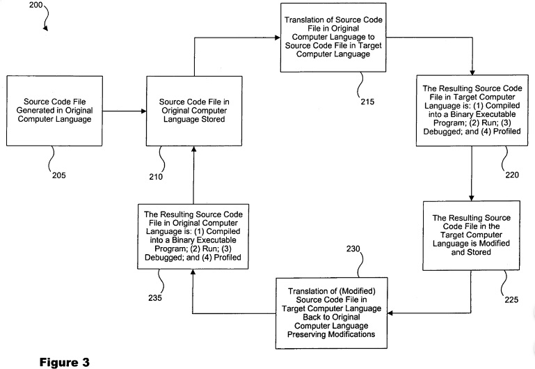

# Programming Languages Translation - a State of the Art

This is a short __State of the Art__ document related to _Programming 
Languages Translation_.

# 1. Introduction

If one try to get the history of research work on programming languages 
tanslation, she will eventually go back to the early 60's. About sixty years 
ago... By those days, researchers were working on programming languages and 
their related compilers, about some formal way to define these languages then 
to implement their compilers.

So, we will first refer to those works that lead to the definition of 
metalanguages, metacompilers and metaprogramming. Since that, many papers and 
patents have been published and registererd. We list a part of them at Annex A 
(Bibliography and Patents) and we discuss those texts in next sections. We 
will then focus on the translation of source code into another source code, 
most work of this having been done in the 90's and up to 2010. Those 20 years 
have been relatively active about translation of programming source codes from 
one programming language to another one.

# 2. Metalanguage, Metaprogramming and Metacompilers

### 2.1 Signification of _meta_

In computering engineering (or in computering science), we are used to use the 
term __meta__ to specify either something that relates to itself or something 
that relates to its own category - for instance, __metadata__ are data that 
refer to or that describe other data.

But __meta__ may also be used for indicating some higher level of abstraction. 
For instance, in object oriented programming a __metaclass__ is a higher level 
of definition of a class. A metaclass is a class for which instances are 
classes.

Let's talk now about __metalanguage__, __metaprogramming__ and 
__metacompilers__.

### 2.2 Metalanguage

As for a metaclass about classes, a metalanguage is a higher level of 
abstraction that helps specifying the properties of other languages. In 1959, 
John W. Backus specified a formal metalanguage[1] that he previously used to 
describe the syntax of some new language, IAL, later renamed ALGOL 58. This 
metalanguage took the name __BNF__ for _Backus normal form_. Peter Naur having 
contributed to the specification of ALGOL 60, the next version of programming 
language ALGOL, Donald E.Knuth later proposed to rename __BNF__ to 
___Backus-Naur Form___, since BNF was not a true normal form and since Peter 
Naur had proposed some useful changes to the metalanguage descrition. This 
last name, Backus-Naur Form, is still used today for BNF.

As a _metalanguage_, __BNF__ describes only the syntax of a language not its 
semantic. BNF is then said to be a _weak_ metalanguage. 

### 2.3 Metaprogramming

__Metaprogramming__ consists in writing a computer program that processes 
other programs as its data. The _metaprogram_ can so read, analyse, transform 
or generate other programs by its own. It can also modify itself at run-time. 

Meanwhile, this concept aims at doing processing at compile-time rather than 
at run-time. It should lead to better time performance since those 
computations are done once, at compile-time, rather than each time at 
run-time.

The metaprogram is written in a metalanguage. It processes programs that are 
written in what is named an _object language_. You may now get the idea that 
a programming language could be its own metalanguage, i.e. the object language 
is the programming language itself. This ability is named _reflexivity_.

So, what's metacompiling?

### 2.4 Metacompilers

Ok, a compiler compiles a programming language into binary code, targeting a 
specified processor, most often for a targeted environment (e.g. an Operating 
System).

A __metacompiler__ is a software application that constructs compilers, 
interpreters or translators for other programming languages. It is a 
metaprogram that is either written in its own metalanguage or written in an 
existing programming language.
- It takes as input a metaprogram;
- It provides as output an executable object program.

The input metaprogram of a metacompiler is coded with a specialized 
metalanguage. We mean, as of a Java compiler that compiles programs written 
in Java, a metacompiler compiles programs written in a metalanguage.

### 2.5 What's up now?

So, what's up with all of this? Once John W. Backus (1924-2007) had specified 
__BNF__ as a metalanguage to describe programming languages, and to specify 
ALGOL 58, people started to use it for other projects.

In 1962, Robert S. Ledley and James B. Wilson proposed a method for the 
automated translation of programming language through syntactical analysis[2].

We may say that the first true works on metacompilers started in 1963, when 
Howard Metcalfe designed a compiler-writing interpreter[3] using the method 
proposed in [2] the year before. He was working in a group that was involved 
in _syntax driven compilers_. Remember, BNF is well suited for syntax rules
definition.

Up to '65, defined languages seemed to be of the from LL(_k_). Languages 
defined with a BNF are context-free languages that are read from left to right 
and for wich derivation of rules executed on the left of the rules. These are 
grammars that are easy to read for humans, that are easy to program and to 
debug also. often, _k_ values to __1__ and states the number of non-read 
symbols that need to be anticipated to evaluate the rule to be derived. In 
1965, Donald E. Knuth proposed in [4] a new approach for deriving rules. In 
this paper, he defined LR(_k_) grammars and proposed algorithms to decide if 
a language programming grammar satisfies le LR(_k_) conditions. __LR__ stands 
for Left-to-write read languages and Right derivation of rules, with _k_ again 
the number of non-read symbols needed to evaluate the derivation. 
Right-derivation means that the evaluation of applied rules starts from the 
leaves of the grammar, up to the root.

### 2.6 Conclusion

From there, many programming languages (as well the very well known and 
largely used ones as the many more confidential ones) have been specified with 
the __BNF__ concept. The related compilers and interpeters have been designed 
according to the nature of the programming languages they were implementing: 
LL(_k_) or LR(_k_). For instance, Python syntax is presented in its online 
documentation with an LL(1) grammar and as such it is an LL(1) language. The 
main advantages of defining programming languages this way is that those 
languages are __context-free__ and __unambiguous__.

In the meantime, it seems that the only translating that was expected from the 
compilers or from the interpreters was the translating of source codes into 
binary code for a targeted processor, to run it either after compile-time 
or at run-time while interpreted on-the-fly.

The first works we have found published on programming languages translation 
from one to another appeared... about 30 years later. Patents related to this 
topic have been registrered by 1994 [10], while a paper published in 1995 
first suggested the mixing of programming languages [5]. Let's go through some 
of these works.

# 3. Translating a Programming Language into another Programming Language

It sounds strange that we have not found work about programming languages 
translation between 1965 and 1994. We might have missed publications. 
Nevertheless, we discuss in this section the papers and patents we have found 
useful.

### 3.1 Generalities about Programming Languages Translation

Some papers relate only to the topic of translating programming languages from 
one to another, which is of high interest to us and our __Typee__ project.

In [7], Lili Qiu addresses the automated translation from C to C++ and the 
manually porting of Java programs to C++. The aim of this paper is to help 
"software reuse". In it, the author inquires the encountered issues and 
investigates solutions for the automation of the programming languages 
translation problem. Obviously, the first identified issues are the types 
translation and the types checking between strong- and weak- typed languages. 
The author finally implemented a semi-automated translator from C to C++, 
which is not much encouraging for our purpose but which may be caused by the 
objective of the paper: investigate issues.

### 3.2 Translation Method with _n_-Rooted Trees

In patents US5768564A and US6031993A [10], Kristy A. Andrews, Paul Del Vigna, 
and Mark E. Molloy propose a method, a program and a computer system "_for 
translating source code from one high-level computer language to another_".

They use a doubly-rooted tree data structure. The two roots are at opposite 
sides of the tree, leaves being created in between the two roots.

The first root starts the parsing of a program written in a first programming 
language. From this parsing are derived:
- __nodes__, describing the different grammar rules that relate to the source 
code syntax. Those nodes are connected by _branches_.
- and __leaves__, describing the final __tokens__ as evaluated according to the 
grammar.

While scanning the initial source code, they built from the first root a 
fragment-tree that describes a virtual source. They finally consider that this 
virtual source represents leaves of the doubly-rooted tree.

The other root of the doubly-rooted tree corresponds to the root of the final 
source code, the one corresponding to the targeted programming language. They 
translate then the source syntax tree to create a target syntax tree. Once 
the leaves of this target syntax tree are identified with leaves of the target 
doubly-rooted tree, they associate leaves of both partial trees and order 
them to get the final translated syntax tree of the targeted programming 
language. A semantic analyzer helps the reconstruction of the target virtual 
source.

### 3.3 Translation of Functional Code to Programming Language Source

ML (contraction of Meta Language) is a generic functional-programming 
language initally developed at University of Edinbourgh in 1970. It supports 
a formal system for elaborating proofs. It has been standardized in 1983. 

In 1998, Andrew Tolmach and Dino P. Oliva published a paper on the translation 
"_from ML to Ada: Strongly-typed language interoperability via source 
translation_" [6]. They describe in there a system that translates ML-like 
functional programming into typed source code (C or Ada) for it to be easily 
integrated in ANSI C or Ada83 source code.

Their translator allows a parametrized specification of types and even of 
operators. They apply code specialization for the removal of polymorphism 
(since ML is compliant with polymorphism while ANSI C is not). They use also 
closure analysis (1) and closure datatypes (2) to, resp., optimize first-order 
code (1) that results from the previous removal of higher-order functions (2).

We did not get access to a full description of their translator, but the 
concept of polymorphism removal sounds similar to the concept of 
multiple-inheritance removal that we have to implement to get translation 
of __Typee__ source code (multiple-inheritance compliant) into _Java_ source 
code (single-inheritance compliant but with multiple-implementations of 
interfaces allowed).

### 3.4 Translation with Intermediate Optimizers

In [11], inventor David Rechter describes a method and a system for converting 
a software language code into another software language code. The inventor 
claims: first the separation of the initial source code and the code dedicated 
to the platform is runs on; second the optimization of the separated source 
code with either a internal or an external optimizer; and third the 
translation of the optimized source code into the target language code and its 
integration with the initial platform code translated into a target platform 
code.

This patent does not describe any translation process since this is not the 
topic it addresses. Quite deceptive for us. But, as long as initial source 
code and initial platform code are not separated or no optimizer is used on 
those codes before translation, this patent can't apply. Well, this is the 
case for the __Typee__ translator which does none of both while it allows the 
embedding of _native_ source code in __Typee__ source code.

### 3.5 Translation of Program Source Code to Markup Languages

Markup languages are of the kind of _XML_, where text is marked with pairs of 
tags. This is the case for _HTML_ also, the ending _ML_ standing for Markup 
Language for both of them.

M. R. Cooper, R. Dutta and K. R. Lawrence present in [12] a method (and 
apparatus) to convert programs and files from a programming language into 
equivalent markup language files. The translation is based on the _document 
type definition_ (DTD) of the targeted markup language and on the parsing of 
the initial source code written in the programming language. Unique 
asociations are done between elements of the DTD and identifiers of routines 
in source code statements. Along the parsing of the initial source code, 
associations are made and associated DTD items are written in the targeted 
ML file.

This is a convenient way to translate languages while association of rules can 
be set either statically or at translation-time between the initial language 
rules and the targeted language ones.

### 3.6 Bi-directional Translation

This is a very important aspect of programming languages translation. Byron D. 
Vargas addresses it in [13]. In this patent, the inventor fully describes the 
concept of back-translating a translated source code once it has been debugged 
and profiled with the environment of the translated programming language. This 
way, any correction or modification applied to the translated source code will 
be back translated to the initial source code without human interaction - see 
next figure (fig.3 of the patent document).

The inventor uses a table defined in an emulated API library. That table 
contains metadata related to the types of data manipulations between the two 
programming languages (the translated initial one and the resulting target 
one). That table contains also references between equivalent functions in both 
programming languages. The initial source code is then analyzed on the type of 
data manipulation it performs and is correlated to the targeted language 
equivalent functions. From this analysis and the evaluated equivalent 
functions, a generator generates the targeted source code such that this code 
will emulated the initial data manipulations.

The generated source code in the targeted programming language can then be run 
independently from the initial source code.

There, the new code can be tested, modified, corrected and the like until it 
is finally validated. The definition of an emulated API library representing 
the translation of the types of data manipulations from the targeted 
programming language back to the initial programming language is then used to 
finally modify the initial source code in its original programming language, 
according to the modifications that have been done in the target source code, 
without human interaction.

In this patent, emulated API libraries and their descriptive and referencing 
tables are the pillar of the translation process. The patent expressely 
addresses the translation betwenn OOP (_object oriented programming_) 
languages and is mainly based on translation of classes first, then their 
methods. In one of the patent claims, Java is precisely cited as the initial 
computer language to be translated, as well as in another claim, garbage 
collector in expressely cited also.

That's an interesting concept that any programming language translator should 
implement. For __Typee__ proof of concept of a translator, we will not address 
such functionality and will not implement such tables and emulated APIs.

### 3.7 Very Specialized Translators

There are two patents that relate to specialized translators.

A first one that we will not discuss but that we cite as an example of a very 
specialized compiler is [15]. There, the eight authors describe a Process for 
automatically translating a high level programming language into an Extended 
Activity Diagram. This is not translating a programming language in another 
programming language but it is still translation.

A second one ([16]) relates to the topic of translating computer languages. It 
is very specialized in that it translate COBOL source code in object oriented 
programming (OOP) languages (C++ is mostly cited in the text). This is 
translation ofprogramming languages, but very specialized. The aim of the 
seven inventors was to help maintaining or augment former COBOL programs by 
providing a more readable but still equivalent source code written in a more 
modern OOP language. Their main concern was about keeping as is the variable 
data storage area of COBOL at run-time of the translated source code. Another 
of their concern was the maintaining of file reads and writes in COBOL while 
running binary code compiled with the targeted computer language compiler. 
Notice that in this patent text, the inventors cite a NACA project and the 
compiler program tool "NacaTrans" which was translating COBOL source code in 
Java source code. This project is unfortunately no more accessible on its 
initial hosting server.

### 3.8 Mixing Compilers

A nice invention ([14]) proposes the use of two programming language compilers 
for translating an initial source code (programmed in the initial programming 
language) in a binary code corresponding to the compilation of the targeted 
programming language.

Kevin Zatloukal, the inventor, describes there a system that embeds the 
compilers of the initial computer language and of the targeted computer 
language and a transformation component.

The first compiler scans and parses the initial source code (see section 2. of 
document [Typee Software Design](./typee-software-design.md) to get an 
overview of how modern compilers are designed).

The parsed representation of the initial source code is provided as input to 
the transformation component and generates a token stream corresponding to the 
tokens and the grammar rules specified by the targeted programming language.

This generated tokens stream is then passed to the second compiler for its 
lexical parsing, its optimizing and finally its compiling into binary code.

The mixing of compilers is implemented there with the help of the 
transformation component.

To be implemented, this invention needs to get a direct access to the internal 
representation of intermediate codes and to the internal components of both 
compilers. These are strong constraints. Meanwhile, no source code of an 
initial computer language is translated in a source code of a targeted 
computer language. But this invention is fine.

### 3.9 Mixing Programming Languages

We finally cite [5], in which Brukhard D. Burrow describes and explains the 
vertues of _mixed language programming_. This is not translation of 
programming languages but this deals with the use of multiple programming 
languages to build a single application. The author suggests keys for this, 
notably convenient ways to express components coded in different programming 
languages for their correct collaboration within the application. A well 
established package by those days (i.e. 1996), `c.fortran.h`, is cited by the 
author as providing "_the desired convenient interface across the C and 
Fortran programming languages_".

Why do we cite this paper? Well, just because __Typee__ offers also practical, 
easy and robust means to mixing programming languages. This is the role of 
Typee statement `embed`.

So, the concept of mixing programming language is not new. In __Typee__, it is 
directly built in the programming language as a natural concept of programming 
in __Typee__ and of the use of its automated translator.

# 4. Conclusion

Well, what should we conclude from the above articles and patents? First, the 
translation of a programming language source code in another programming 
language source code has alreday been addressed. It is based on former work 
about specifying unambiguous grammars for the specificaiton of programming 
languages. Some papers relate to preliminary work with the aim at 
understanding where challenging issues were hidden. Some other works relate to 
translators adapted to dedicated languages. Most of them relate to the sole 
translation of an initial programming language source code in another 
programming language source code with no revert translation. But one of them 
addresses the back-translation as a convenient way to automate the maintaining 
of source code in its both languages versions when one version is modified or 
corrected. Finally, some other works propose the mixing of compilers 
activities, which involves the accessibility of the internal components of the 
whole used compilers, or propose the mixing of programming languages in 
different communicating modules to implement modern applications.

See Annex A for references to papers and patents discussed in this document.

## Annex A - Bibliography and Patents

### A.1 Bibliography

| Ref. | Paper citation |
|:---:|---|
| [1] | _The Syntax and Semantics of the Proposed International Algebraic Language of the Zurich ACM-GAMM Conference_. J. W. Backus. Proceedings of the International Conference on Information Processing, UNESCO, 1959, pp.125-132. [http://www.softwarepreservation.org/projects/ALGOL/paper/Backus-Syntax_and_Semantics_of_Proposed_IAL.pdf](http://www.softwarepreservation.org/projects/ALGOL/paper/Backus-Syntax_and_Semantics_of_Proposed_IAL.pdf) |
| [2] | _Automatic-programming-language translation through syntactical analysis_. Robert S. Ledley and James B. Wilson. 1962. Commun. ACM 5, 3 (March 1962), 145-155. DOI=http://dx.doi.org/10.1145/366862.366872 |
| [3] | _A Parameterized Compiler Based on Mechanical Linguistics_. Howard Metcalfe. Planning Research Corporation R-311, March 1, 1963, also in Annual Review in Automatic Programming, Vol. 4 |
| [4] | _On the translation of languages from left to right_. Donald E.Knuth. Information and Control Volume 8, Issue 6, December 1965, Pages 607-639 |
| [5] | _Mixed Languages Programming_. Burkhard D. Burow. in Computing in High Energy Physics '95, 1996, pp. 610-614. |
| [6] | _From ML to Ada: Strongly-typed language interoperability via source translation_. Tolmach, A., Oliva, D. 1998. Journal of Functional Programming, 8(4), 367-412. |
| [7] | _Programming Language Translation_. Qiu, Lili, [Cornell University, 1999-05](https://ecommons.cornell.edu/handle/1813/7400) |

### A.2 Patents

| Ref. | Patent citation |
|:---:|---|
| [10] | _Method and apparatus for translating source code from one high-level computer language to another_. Kristy A. Andrews, Paul Del Vigna, Mark E. Molloy. US5768564A and US6031993A. 1994-10-07. |
| [11] | _System for automatically converting source code from one programming language to another_. David Rechter. US6698014B1. 1999-10-14. |
| [12] | _Method and apparatus for converting programs and source code files written in a programming language to equivalent markup language files_. Michael Richard Cooper, Rabindranath Dutta, Kelvin Roderick Lawrence. US6986101B2. 1999-05-06. |
| [13] | _System for translating programming languages_. Byron D. Vargas. US7346897B2 and US8332828B2. 2002-11-20. |
| [14] | _Method and system for translating programming languages_. Kevin Zatloukal. US7823139B2. 2003-07-19. |
| [15] | _Process of automatically translating a high level programming language into an extended activity diagram_. Fu-Chiung Cheng, Kuan-Yu Yan, Jian-Yi Chen, Shu-Ming Chang, Ping-Yun Wang, Li-Kai Chang, Chin-Tai Chou, Ming-Shiou Chiang. US20070169054A1. 2005-12-30 |
| [16] | _Method for translating a cobol source program into readable and maintainable program code in an object oriented second programming language_. Todd Bradley Kneisel, Cynthia S. Guenthner, Albert Henry John Wigchert, Nicholas John Colasacco, Russell W. Guenthner, John Edward Heath, Clinton B. Eckard. US9182962B2. 2010-12-09. |

## Annex B - This document revisions history

| Date  | Rev.  | Author(s)  | Comments  |
|:---:|:---:|---|---|
| 2018-08-17 | 0.0.1 | Schmouk | Created from scratch; Instered first version of bibliography (just links to) |
| 2018-08-18 | 0.0.2 | PhHays | Completed sections 1. and 2.; Put bibliography on correct form |
| 2018-08-18 | 0.0.3 | PhHays | Augmented section 3. with subsections 3.1 to 3.6 and 3.9 (temporary numbering) |
| 2018-08-19 | 0.1.0 | PhHays | Completed section 3.; Added section 4.; Document needs now reviewing |
|  |  |  |  |
