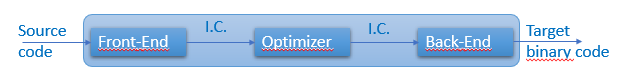
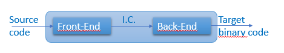
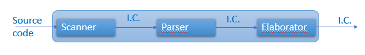
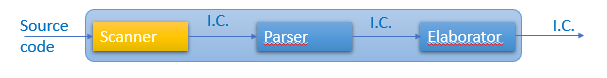
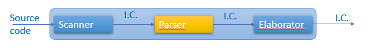
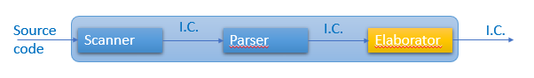
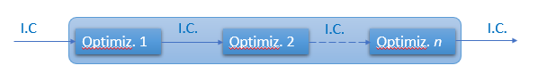
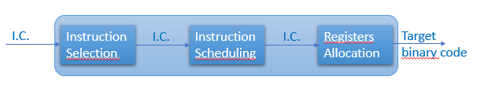

# Typee Software Design

This document is part of the Open Source project __Typee__. As such, it is
delivered under the MIT license:
```
Copyright (c) 2018 Philippe Schmouker, Typee project, http://www.typee.ovh

Permission is hereby granted,  free of charge,  to any person obtaining a copy
of this software and associated documentation files (the "Software"),  to deal
in the Software without restriction, including  without  limitation the rights
to use,  copy,  modify,  merge,  publish,  distribute, sublicense, and/or sell
copies of the Software,  and  to  permit  persons  to  whom  the  Software  is
furnished to do so, subject to the following conditions:

The above copyright notice and this permission notice shall be included in all
copies or substantial portions of the Software.

THE SOFTWARE IS PROVIDED "AS IS",  WITHOUT WARRANTY OF ANY  KIND,  EXPRESS  OR
IMPLIED,  INCLUDING  BUT  NOT  LIMITED  TO  THE WARRANTIES OF MERCHANTABILITY,
FITNESS FOR A PARTICULAR PURPOSE AND NONINFRINGEMENT.  IN NO EVENT  SHALL  THE
AUTHORS  OR  COPYRIGHT  HOLDERS  BE  LIABLE  FOR  ANY CLAIM,  DAMAGES OR OTHER
LIABILITY, WHETHER IN AN ACTION OF CONTRACT,  TORT OR OTHERWISE, ARISING FROM,
OUT  OF OR IN CONNECTION WITH THE SOFTWARE OR THE USE OR OTHER DEALINGS IN THE
SOFTWARE.
```


This document describes the global software design of the __Typee__ 
translator. We first explain how we have decided to design this translator. 
Since this design has been largely inspired by _compilers_ general design, we 
explain then how modern compilers are designed. In the third section, we
explain the derivative way we have used to design the __Typee__ translator.
Finally, we list packages and their roles as well as modules in packages and
the role of each of them also.

We expect this document to help the reader to understand how the __Typee__ 
translator has been thought and designed with programming language _Python_, 
and help anyone who would like to contribute to understand what enhancements 
could be proposed and how they could be designed and implemented.

Most of the text of this document has been copied from or has been duplicated 
in other documents elsewhere in this __Typee-Language/Typee__ repository.


# 1. Typee Design Concepts

__Typee__ is an Object Oriented Programming language. Its syntax is derived 
from other OOP language such as _C++11_, _Java 8.0_ and _Python 3.6_.

Traditionnal OOP languages are either compiled (e.g. C++) or interpreted (e.g. 
_Python_ ). They even may be first compiled into an intermediate code which is 
then interpreted (e.g. Java and its Bytecode interpreted by a 
_Java Virtual Machine_ that has to be implemented on each of the different 
targetted devices).

Meanwhile, __Typee__ language is neither compiled nor interpreted. It is 
rather translated into other OOP languages, such as _Python_ (which 
chronologically is the first addressed OOP language from: _Python_, _C++_ and 
_Java_). During the translation, type infering and checking is done not only 
for APIs but also on all the other parts of the code.

So, we got greatly inspired by modern compilers design to design the __Typee__ 
translator. Our bedside book for a long has been "_Engineering a Compiler_",
2nd edtition, Keith D.Cooper & Linda Torczon, 2012, Elsevier, ISBN 
978-0-12-088478-0. and we encourage the reader to read this book.

We have choosen this book because it was newer than the famous Dragoon book 
"Compilers, principles, techniques, & tools, 2nd ed." from Alfred V. Aho, 
Monica S. Lam, Ravi Ethi and Jeffrey D. Ullman, Pearson-Addison Wesley, 2007, 
while this Dragoon book had been used to specify the _Python_ interpretor 
_CPython_.


# 2. Modern Compilers Design

By 2018, modern compilers are designed with three distinct communicating 
software modules: the _Front-End_, the _Back-End_ and the _Optimizer_. A 
drawing will be simpler to understand.



First, the source code to be compiled is processed by the compiler 
_Front-End_. During this phase, the source code is _scanned_ to detect key 
words, numbers, identifiers and the like and _parsed_ to check its syntax 
correctness. The _Front-End_ transfers to the compiler _Optimizer_ an internal 
representation of the source code, which is noted __I.C.__ (Intermediate Code) 
in the above picture.

Second, the I.C. is processed by the _Optimizier_ whose job is to statically 
optimize the intermediate code. For instance, this consists in the deleting of 
dead code or in the transforming of never-changing variables content into 
constant values. Many other optimizations may be generated by the _Optimizer_.
A new version of the intermediate code, the optimized one, is then passed to 
the compiler _Back-End_.

Third, the optimized version of the I.C. is processed by the _Back-End_.
There, the final binary code to be ran on the target processor is generated. 
Final static optimizations may be generated during this phase also, according 
to the specificities of the target process unit.

Well, this is for the design of three-phase compilers, but two-phase compilers 
exist also, with no _Optimizer_ phase. See coresponding schema below.



To get a little bit more information on those three phases of a modern 
compiler, see the three next sub-sections. They are short. But to know more, 
the reader should refer to any book on compilers design. Remember, the one we 
have used for the design of Typee translator is "_Engineering a Compiler_",
2nd edtition, Keith D.Cooper & Linda Torczon, 2012, Elsevier, ISBN 
978-0-12-088478-0.


## 2.1 The _Front-End_

The __Front-End__ of a compiler is a three-phase module. See figure below.



Explanations are provided in the next three subsections.


### 2.1.1 the _Scanner_



The source code to be compiled is first scanned by the _Scanner_. This module 
transforms the source code to an ordered list of tokens. This phase of the 
__Front-End__ is named also _tokenizer_.

What is a token? It is an entity that describes a whole atomic element of the 
programming language. For instance, there is one token for each of the 
built-in instructions of the language (e.g. ___for___, ___if___, ___else___ 
just to name a few, which are associated with resp. to _token_FOR_, _token_IF_ 
and token_ELSE). Numbers are associated with one token. Identifiers are also, 
whatever they identify: constants, variables, functions, classes or methods, 
etc. Operators are each associated also with tokens (e.g. '=', '+', '<=', 
etc.) Each token is a data structure that may contain local information, such 
as, for instance, the line number and the column index of the corresponding 
text, and this text itself (e.g. for an identiifer or for a scalar constant).

So, the _Scanner_ takes as input the source code to be scanned and puts as its 
output some _intermediate code_ (I.C.) which is mainly an ordered list of 
detected tokens. This ordered list is then the input of the next phase of the 
__Front-End__, the _Parser_. Let's call it the _tokenized I.C._


### 2.1.2 the _Parser_



The _tokenized intermediate code_ is passed as input to the _Parser_. This 
module parses this I.C. and checks for its correctness according to the 
specified syntax of the programming language.

Such a syntax is defined by its _grammar_. The rules defined this grammar 
describes what are the legal successions of tokens for the defined programming 
language. For instance, in C++, a legal ___if___ instruction is defined to be 
something like this:

```java
if ( <some test> )
    <a block of instructions or a single instruction>
else
    <another block of instructions or another single instruction>
```

Should any token corresponding to the parenthesis be missing after token 
_token_IF_ in the tokenized I.C, the _Scanner_ would detect some syntax error 
in the source code. The __Front-End__ may then inform the user of these 
syntax errors and most often does not try to correct them.

The output of the _Parser_ is another form of _intermediate code_ which still 
lists the tokens in the order of their appearing in the source code plus maybe 
some information about the syntax used and the maybe detected errors in the 
source code. This _parsed intermediate code_ is then the input of the last 
phase of the __Front-End__, the _Elaborator_. 


### 2.1.3 the _Elaborator_



The _parsed intermediate code_ gets statically elaborated in the last phase of 
the __Front-End__, the _Elaborator_. This module finalizes the Front-End 
operations to check for the semantic correctness of the source code.

Among the many elaborations that can take place, we list only two of them just 
for illustrating the kind of processing the _Elaborator_ runs.

#### Identifiers Checking

The use of identifiers is checked. Is an identifier associated with a constant 
value? Or is it the name of a function, of a class, of a method or of a 
variable? According to this information, is it used in a correct way. For 
instance, by no way should an _Elaborator_ accept the modification of the 
value associated with the identifier of a constant value, as long as the 
programming language allows declarations of constants. Meanwhile, by no way 
the identifier of a scalar variable should be used as a called function.

#### Types inferring and checking

Another kind of elaboration of a source code is the inferring of types (for 
variables and for expressions) and the checking of the correctness of those 
types use. For instance, assigning a long scalar in a variable with shorter 
scalar type may be an issue, and be considered as a warning or as an error 
according to the programming language defined policy.

This type checking is of most importance for typed programming languages. When 
done at compile time, i.e. in a static manner, it allows the static detection 
of possible errors at run time __before__ running the final binary code. This 
way, no type checking, which is costly, has to be implemented at run time.

#### _Elaborator_ output

The _Elaborator_ provides either a list of detected errors or a new form of 
_Intermediate Code_ that we will call the _elaborated I.C._

The errors delivered by the _Elaborator_ may have been detected: by the 
_Scanner_, about badly formed or unknown detected tokens; by the _Parser_, 
about syntax errors; and by the _Elaborator_, for instance about types usage 
errors. Whatever the detected errors, they most often are printed on a console 
or in a log file.

The _elaborated I.C_, if source code has been detected as free of errors by 
the __Front-End__, is then passed to the second phase of the compiler, which 
is the _Optimizer_ for three-phase compilers, or the _Back-End_ for two-phase 
compilers.


## 2.2 The _Optimizer_

Three-phase compilers implement their second phase as a _code Optimizer_. We 
shall not say much about this. The reader is strongly encouraged to see theory 
and explanations in Compiler Design books. Remember, our bedside book for a 
while about this has been "_Engineering a Compiler_", 2nd edtition, Keith 
D.Cooper & Linda Torczon, 2012, Elsevier, ISBN 978-0-12-088478-0.



The _Optimizer_ takes as input the _elaborated intermediate code_ provided by 
the compiler __Front-End__ and generates an _optimized intermediate code_ as 
its output. This _optimized I.C._ is then provided as input to the compiler 
__Back-End__.

The _Optimizer_ is generally designed as a succession of different levels of 
optimization (see figure above). We list here  four of them: __local__ , 
__regional__, __global__ and __interprocedural__ optimizations.


### 2.2.1 Local optimizations

These are the simplest optimizations. They are operated on local blocks of 
instructions and are considered to be very efficient.

An example of such optimization is the simplification of successive 
instructions when local values of variables are not modified or when 
redundancy can be detected in some of these successive instructions. The 
_Optimizer_ automatically removes or simplifies those instructions in the 
_Intermdiate Code_.

Another example of such optimization is when parallelization of instructions 
processing can be detected in successive independent instructions. Such 
instructions may then be reordered in the _I.C._ by the _Optimizer_ so that 
the _Back-End_ phase of the compiler can later implement more efficient binary 
code if possible.


### 2.2.2 Regional optimizations

Well, code in a block of instructions may also provide or prepare context for 
usefully  improving the code in another block of instructions. Regional 
optimizations deal with this.

This way, for instance, the _Optimizer_ can find redundancies and 
constant-valued expressions that a strictly local optimization would fail to 
detect. The _I.C._ can then be smartly modified to take benefit of already 
known context.

The technique of _loop unrolling_ is also a regional otpimization. Unrolling 
loops leads to code duplication within loops. If this is not a memory space 
optimization, it is a time consuming one since the loop control is processed 
less times than with no unrolling.


### 2.2.3 Global optimizations (and analysis)

These optimizations deal with code at an entire function level. , for 
instance, they may help:

- detecting uninitialized variables before their use (analysis for error 
detection);
- modifying the placement of global code (optimization).

Using variables before their initialization should be considered as an error, 
since this will mostly lead to some unpredictable behavior of the program. The
detection of such errors before run time can be done by the _Optimizer_ phase 
of a compiler.

The modification of the placement of global code deals with the 
characteristics of the target processor. For instance, as long as branching 
cost can be statically evaluated, the _Optimizer_ may exchange the places of 
blocks of instructions just to diminish the time processing of a program.


### 2.2.4 Interprocedural optimizations

This is somewhat the _higher_ level of otpimizations that can be envisaged. 
Those optimizations deal with groups of functions or methods, trying to 
understand or evaluate their contexts to take benefit of them across functions 
while this would not be possible with intra-procedural (i.e. global) 
optimization.

A first, simple, optimization is the modification of the placement of functions 
code within the final binary image of the program when the _Optimizer_ can 
detect that one function calls another one. Placing them as near as possible 
of each other in the final code may optimize time processing, for instance 
when the instructions set of the target processor provides short and long 
range branching and when short branching is quicker than long branching.

A second, not very more complex, optimization at interprocedural level is the 
inlining of functions calls. Rather than generating a call to a function, the 
_Optimizer_ may decide to inline the whole code of a function, in place of its 
call, into the code of the calling function.


### 2.2.5 _Optimizer_ - conclusion

Optimizations are an important part of a compiler. Thye may take time to be 
processed but they provide optimization either on memory space allocation or 
on time processing ar runtime. They help improving the implementation of a 
program in an aitomated manner with no needed user's intervention.

They are implemented in a dedicated phase within three-phase compilers, but 
they may also be implemented in either the Front-End or the Back-End phase of
a two-phase compiler.


## 2.3 The _Back-End_

The final phase of a compiler is the _Back-End_. It deals with the generation 
of the final binary code according to the target processor and the target 
Operating System. It is mainly a three-phase mmodule.



The _Back-End_ gets as its input the _elaborated intermediate code_, as long 
as this I.C. has been generated. Should the previous phases of the compiler 
have detected errors, the _Back-End_ would not be ran.


### 2.3.1 Instruction Selection

The _elaborated I.C._ is first evaluated for the __selection__ of 
corresponding processor __instructions__. For instance, the assignment of a 
scalar value to some variable will involve at least an assembly instruction 
for the storage of the value into a memory place. But it could be also an 
assembly instruction dealing with register assignment which is far more 
efficient on time consuming. Another example would be the selection of a 
branching assembly instruction according to some test done while implementing 
an ___if___ instruction. Of course, this step of the _Back-End_ generates an 
_intermediate assembly code_, maybe associated with additionnal informatin 
data to help next step processing.


### 2.3.2 Instruction Scheduling

Then, this _intermediate assembly code_ is processed by a next step of the 
_Back-End_ : the __instruction scheduling__. This is some kind of optimization 
that the _Back-End_ may be able to envisage if some assembly instructions are 
available that do time-shorter procesing. For instance, this could be an 
addition of a register with itself rather than a multiplication by 2 or a 
left-shift by 1 bit. It may also invert the position of instructions in the 
flow of the processing to take benefit of some characteristics of the target 
processor (this may be the case when branching for some RISC processors). the 
instruction scheduling generates a modified _intermediate assembly code_ which 
is the input of the final step of the compiler _Back-End_.


### 2.3.3 Registers Allocation

This is the final step of the _Back-End_ processing. Processors have a limited 
set of registers. This step aims at using all of them in the best way. The 
input _intermediate assembly code_ is analyzed here to finally generate a 
binary code with the best use of the target processor registers. This means 
that direct access to memory may be imposed, should the registers be too few.


### 2.3.4 _Back-End_ output

The _Back-End_, when called, eventually generates binary assembly code 
dedicated to the target processor. This code can be either formatted code 
with linking information for further linkage with other binary code modules or 
binary code immediately executable on the processor, associated with the 
mandatory embedded glue for it to run n a target environment (e.g. Windows, 
Linux, MacOS, etc.)


## 2.4 Modern Compilers Design - Conclusion

Being either three-phase or two-phase designed, a compiler is composed of:
- a _Front-End_ which mainly parses the source code of a program;
- a _Back-End_ which mainly generates the binary code to be ran on the target processor;
- and automated optimizations to generate the best final code.

The work done here is a smart translation of a source program easily 
understandable by humans to a binary optimized representation easily 
executable by a target processor in a target environment.

This is one of the reasons why the __Typee__ translator may be designed as a 
compiler, since it translates a Typee source program into some other 
programming language source code, for instance _Python_, _C++_ or _Java_.

The main point here is that some of a compiler modules are not needed for the
__Typee__ translator. For instance, the implementation of optimizations is not 
necessary if we consider that this step will be deferred to the final _C++_ or 
_Java_ compiler or to the final _Python_ interpretor.

Furthermore, many of the tasks devoted to the _Back-End_ may be either 
simplified or even ignored by Typee translator since it does not generate 
binary code but source code in some other programming language. 


# 3. Typee Translator Design -- from Compiler design

As stated in the above conclusion (see subsection 2.4) the __Typee__ design is 
simpler than the one of a compiler, since __Typee__ is a programming languages 
__translator__ and not a true compiler.

Why is it simpler? Because, as a translator, Typee neither generates binary
code nor optimizes source or intermediate code. Its two main acitivities are 
_static type checking_ and _translation_ from programming language Typee to 
another programming language such as _Python_, _C++_ or _Java_.

Nevertheless, to envisage the design of Typee translator as would be the 
design of a modern compiler is staightforward:


__Typee__ source code is first processed by Typee _Front-End_. At this phase 
of the translation, Typee source code is scanned, parsed and elaborated. An
_elaborated intermediate code_ is generetad by the _Front-End_ and transferred 
to Typee _Back-End_.

The _elaborated intermediate code_ is then processed by Typee _Back End_. 
There, all the translation work to another programming language is done, as 
would have been the translating of this intermediate code to some binary 
target code within a compiler.

Meanwhile, many of the tasks done in a compiler are simpler in Typee 
translator implementation.

Furthermore, the _elaborated intermediate code_ is totally independent of the 
target programming language. It only depends on the specifications of Typee 
language. So, the exactly same interface between Typee _Front-End_ and Typee 
_Back-End_ will serve the same purpose for any kind of target programming 
language (i.e. _C++_, _Java_ or _Python_).

A consequence of this is that a same _interface_ will have to be implemented 
for each target programming language: a version of the _Back-End_ will 
translate _elaborated intermdiate code_ to _Python, another version will 
translate _elaborated I.C._ to _C++_, a third one will translate the same 
_elaborated I.C._ to _Java_, etc.


## 3.1 Typee Front-End

__Typee__ _Front-End_ is a three-phase front-end, as is the case for any 
modern compiler.


It takes as input the source code of a Typee program or file and generates as 
its output an _elaborated intermediate code_ that is further processed by the 
Typee _Back-End_.

We describe the design of each of these three __Typee__ _Front-End_ phases in 
the next subsections.


### 3.1.1 Typee Front-End _Scanner_

The _Scanner_ of __Typee__ _Front-End_ deals with tokens. It takes as input some 
__Typee__ source code, scans it, and generates an ordered list of tokens: 
the _tokenized intermediate code_ that is provided for input to the __Typee__ 
_Front-End Parser_.


#### What's in a token?

In __Typee__, a token is associated with an ID and a default text. Let's take 
an example. __Typee__ specifies keywords. Among them are instruction keywords, 
for instance `if`. A specific token is associated with keyword `if`. 
It gets a unique ID and the associated default text is "`if`". There are many 
other kinds of tokens, such as a single token to identify identifiers, tokens 
for every legal punctuation sign, tokens to identify numbers, tokens to 
identify operators, etc.

Class `FEIcodeToken` defines all the tokens IDs and the associated default 
texts when this gets meaningfull. For instance, there is no default text 
associated with the token for identifiers since there is no default text 
corresponding to any identifier. The related text is rather associated with 
the _identifier-token_ each time an identifier is discovered in the scanned 
Typee source code.


#### Tokens and token nodes

Class `FEICodeTokenNode` finally defines the data structure that is linearly 
appended to the _tokenized intermediate code_ data. Remember, this is an 
ordered list of tokens that is generated by the _Scanner_ and that is provided 
as input to the _Front-End Parser_. This list contains token __nodes__ which 
are defined by class `FEICodeTokenNode`. The attributes of each node are:

- the related token ID;
- the associated text as scanned in the Typee source code;
- the line number in the source code and the column index in this line of the 
asociated text with this token.


#### The _tokenized intermediate code_

Finally, class `FETokenIntermediateCode` defines the _intermediate code_ 
generated by the _Front-End Scanner_. Since it is currently  implemented in 
_Python_, this is just a wrapper to Python built-in type __list__.

The Typee _Front-End Scanner_ runs through the Typee source code, detects 
any Typee keyword, any legal punctuation or separator sign, any valid number 
or other scalar values (boolean ones, string ones, etc.), any indentifier as 
separated by spaces, tabs and legal other separators, any legal operator, and 
maybe any badly formed, unknown or not valid text (such as "`125xyz`" which is 
neither a correct number nor a correct identifier in Typee).

The _Scanner_ then appends the related token node to the list of the already 
detected _token nodes_. Remember, this is the _tokenized intermediate code_. 
Badly formed text is also detected by the _Scanner_ and replaced in this 
intermediate code by a dedicated token node, the __unexpected token__ node. 
This is a useful information to pass to the _Parser_. It allows also for the 
delaying of errors printings after the completion of Typee _Front-End_. This 
way, warnings and errors can be displayed on console or saved in log file in 
the increasing numer of the Typee source code line they have been detected in.

Finally, the _Scanner_ passes to the _Parser_ the _tokenized intermediate code_ 
which is an instance of class `FETokenIntermediateCode` and which contains an 
ordered list of _token nodes_.


#### The Front-End Scanner implementation

The code of the _Front-End Scanner_ is implemented by class `FEScanner`. This 
class defines two scanning methods: `scan_file()` and `scan_memory()` for 
which names are self explanatory. `scan_file()` opens a Typee source code file 
and loads it in memory, then it calls `scan_memory()`. `scan_memory()` 
directly scans source code loaded in memory. Their output is an instance of 
class `FETokenIntermediateCode`, i.e. a _Python_ list of _token nodes_ (each 
of which is an instance of class `FEICodeTokenNode`).


### 3.1.2 Typee Front-End _Parser_

The _Parser_ of __Typee__ _Front-End_ deals with source code syntax 
correctness. It takes as input the _tokenized intermediate code_ generated 
by the _Scanner_ and checks the succession of tokens against the __Typee__ 
language grammar specification. It generates an _intermediate code_ that it 
has syntaxically verified, with maybe syntax errors detection flags put in it. 
This _intermediate code_ is then passed to the _Front-End Elaborator_. We name 
it the _syntaxic intermediate code_.


#### Programming languages and grammar descriptions

__Typee__ grammar is specified according to the _Backus-Naur Form_ (_BNF_). 
Tis is a very common and easy way to fully specify the _context-free_ grammar 
of a language. Here is an excellent article about BNF and its extensions: 
[http://matt.might.net/articles/grammars-bnf-ebnf/](http://matt.might.net/articles/grammars-bnf-ebnf/).
The curious reader (and all readers should be curious) is strongly encouraged 
to click on this link and to read this article which "_explains grammars and 
common notations for grammars, such as Backus-Naur Form (BNF), Extended 
Backus-Naur Form (EBNF) and regular extensions to BNF. After reading this 
article, you will be able to identify and interpret all commonly used 
notation for grammars._" (extract from Matt Might's article).


#### A simple example

Let's take an example. A BNF grammar rule to specify a very simple `for` 
instruction could be something like:

```
<for statement> ::= "for" "(" <identifier> "in" <range> ")" <simple statement> ";"
```

For instance, this is a legal `for` loop according to the above grammar rule:
```
for( i in [0:10] )
   print( i );
```

The list of tokens as provided by the _Front-End Scanner_, i.e. the 
_tokenized intermediate code_, would then be something like this (with very 
symbolic notation):
```
token_FOR
token_(
token_IDENT "i"
token_IN
token_[
token_NUMBER "0"
token_:
token_NUMBER "10"
token_]
token_)
token_IDENT "print"
token_(
token_IDENT "i"
token_)
token_;
```

The _Front-End Parser_ runs through this list of tokens and checks for the 
validity of the tokens chain against the related grammar rule. You will 
easily verify by yourself that this list of tokens is definitively valid, as 
long as `<range>` is specified as something like `[0:10]` and as long as 
`print( i )` is a valid `<simple statement>`.


#### Syntax errors checking

Now, should there is any syntax error in previous code, for instance because 
of a missing parenthesis, a badly formed range definition or a missing `;` by 
the end of the single statement, the _Front-End Scanner_ will detect it while 
parsing the source code and checking it against the related grammar rule. 
Moreover, the _Parser_ is able to get what is syntaxically wrong, either 
missing or badly formed, and is able to report the related error with the line 
number in the source code and the column index in this line of the erroneous 
syntaxic item.

Furthermore, should any syntax error be detected, the _Parser_ is able to skip 
as little part of the source code as possible. This is __error recovering__. 
With __Typee__, error recovering is done by searching for the next `;` token, 
which is the end of every statement, or for the next token `}` in the case of 
an error occuring in a block of instructions and for which no `;` can be 
found before the `}`.


#### The _Parser_ implementation

__Typee__ programming language is specified according to an LL(1) grammar. 
As such, it is an LL(1) language. This class of grammars have many advantages 
while developing a _Proof of Concept_ (PoC). They are __context-free__ 
grammars, which means that nothing has to be remembered about what has been 
previously done when parsing source code. They are __fully deterministic__, 
which means that they definitvely are _unambiguous_ grammars. The code they 
define is parsed from Left to right and the _Parser_ of LL(1) grammars 
constructs Leftmost derivations while parsing the source code.

LL(1) parsers can be implemented with tables as well as with recursive descent 
functions. They are deterministic, context-free, and intuitive to understand, 
on the contrary of LR(1) parsers which might be more efficient at run-time but 
which are far more complicated to implement, to debug and to read.

The current implementation of the __Typee__ _Parser_ has been developped in 
_Python_, as a dedicated class `FEParser` with methods to implement every 
rules of __Typee__ grammar. This was the easiest and simplest way to develop, 
debug and maintain a PoC for the validation of __Typee__ concepts.

Each method of class `FEParser` gets the leading name of one of the grammar 
rules. It calls other methods according to the rule definition. Atomic methods 
finally check for expected tokens.

The _Parser_ runs through the _tokenized intermediate code_, gets one _token 
node_ at a time and checks it against the __Typee__ grammar rules. Every time 
an error is detected, which happens every time an __unexpected token node__ is 
read from the _tokenized intermediate code_ or when some token node is read 
while not expected or is missing while expected, the _Parser_ generates a 
_syntaxic error_ node in its generated _intermediate code_ and recovers the 
error as smartly as possible (searching for the next `;` or `}` token).

The parsing is ran via method `parse()` which parses the _tokenized 
intermediate code_ passed at its main argument. Remember, this is a _Python_ 
list in memory that has been previously generated by the _Front-End Scanner_.


#### Resulting _intermediate code_

The _Front-End Parser_ generates an _intermediate code_ that embeds the 
_tokenized intermediate code_ it got as input from the _Scanner_. This _I.C._ 
contains all the generated _token nodes_, including the _unexpected token_ 
nodes that had been inserted by the _Scanner_. The _Parser_ adds to these 
the _syntaxic error_ nodes it generates when encountering such errors.

Furthermore, the resulting _intermediate code_ is formatted by the _Parser_ 
to reflect the syntaxic nature of the source code. If you go to the last 
version of Typee grammar specifications - look at all successive versions in 
[../Language-specifications/](../Language-specifications/) - you will see that 
a Typee source code is defined as:
```
<code file> ::= <statements list> <ENDOFFILE>
```
with `<statements list>` defined as:
```
<statements list>       ::= <empty statement> <statements list>
                         |  <compound statement> <statements list>
                         |  <simple statement> <statements list>
                         |  <statements block> <statements list>
                         |  EPS
```
and these other statements defined as:
```
<empty statement>       ::= <comment>
                         |  <NEWLINE>

<compound statement>    ::= <assign decl def func-call statement>
                         |  <embed statement>
                         |  <for statement>
                         |  <forever statement>
                         |  <if statement>
                         |  <repeat statement>
                         |  <switch statement>
                         |  <try statement>
                         |  <while statement>
                         |  <with statement>

<simple statement>      ::= <assert statement> <simple statement end>
                         |  <del statement> <simple statement end>
                         |  <ensure statement> <simple statement end>
                         |  <flow statement> <simple statement end>
                         |  <import statement> <simple statement end>
                         |  <nop statement> <simple statement end>
                         |  <access protection statement> <simple statement end>
                         |  <raise statement> <simple statement end>
                         |  <require statement> <simple statement end>

<simple statement end>  ::= ';'

<statements block>      ::= '{' <statements list> '}'
```

According to these grammar rules, each time the _Parser_ starts the parsing of 
one of these rules it appends to the _syntaxic intermediate code_ a new 
_statement node_ to which it attaches a list of either _statement nodes_ or 
_token nodes_. These nodes are the ones related to the currently parsed 
statement rule.

The _syntaxic intermediate code_ is then a __tree__ that reflects the exact 
syntaxic structure of the parsed __Typee__ source code. This design greatly 
helps the further _semantic analysis_ of the source code that can then take 
benefit of this structured information.

Let's see now what is this _semantic analysis_ of the generated _syntaxic 
intermediate code_. This analysis is performed by the third and last phase of 
the _Front-End_: the _Elaborator_.


### 3.1.3 Typee Front-End _Elaborator_

So, this is the third and last phase of the _Front-End_. It gets as input the 
_syntaxic intermediate code_ generated by the _Front-End Parser_. Remember, 
this is a __tree__ that reflects the syntaxic structure of the translated 
__Typee__ source code.


The _Elaborator_ semantically analyzes the _syntaxic intermediate code_ and:
- categorizes every detected identifier;
- infers types;
- checks for uninitialized identifiers before their use;
- checks for the correctness of types use.

It either generates a _validated intermediate code_ and tranfers it to the 
__Typee__ _Back-End_ or provides an errors report if errors have been detected 
by the _Scanner_ or the _Parser_. This report may be display on console and/or 
saved in log file.


#### Categorization of Identifiers

The _Front-End Scanner_ detects identifiers according to dedicated rules or 
__Typee__ grammar. Well, identifiers in Typee are constructyed the same way 
as any other programming languages. They can be constituted of letters, digits 
and underscores. They cannot begin with a digit. They are case-sensitive.

Identifiers are used to identify so many entities in __Typee__:
- classes;
- methods of classes;
- attributes of classes;
- functions;
- variables;
- constant values;
- types.

They can also be used for aliasing other entities. For instance, in __Typee__ 
type names contain the kind of type and its bits length. For instance: 
`int32` stands for 32-bits signed integers, `uint32` stands for 32-bits 
unsigned integers. `float32` and `float64` exist also in the same way. Keyword 
`as` may be used to alias those types, as in next code.

```
type int32   as long;
type float32 as float;
type float64 as double;

```

In Typee, `
int32`, `float32` and `float64` are built-in types while `long`, 
`float` and `double` are identifiers in upper code. They are identifiers of 
types.

The _Scanner_ generates a specific token for built-in scalar types. It 
generates also a specific token for identifiers, whatever they identify.

It is the activity of the _Elaborator_ to elaborate the kind of entity an 
identifer identifies. This is __semantic__ analysis of Typee source code. It 
is based on the running through rules to get what kind of Typee entity the 
identifier is associated with. For example, in next Typee code `MyClass` 
identifies a class, `f` identifies a class method, `val` identifies a class 
attribute and `i` identifies a variable. `class`, `static`, `const` and 
`int32` are Typee keywords. Finally, `print` is a Typee built-in function but 
is detected as an identifier that has to be categorized as identifying a 
function.
```
class MyClass {
    static const int32 f() { return MyClass.val; }
    static int32 val = 0;
}
int32 i = myClass.val++;
print( i, val ); // this prints "0 1" on console.
```

Those categorizations are elaborated according to the rules of Typee grammar. 
These rules unambiguously specify what an identifier identifies. For example, 
the next Typee grammar rule specifies the correct syntax for the declaration 
of classes.
```
<class definition>  ::= 'class' <identifier> <template def> <inheritance> <statements block>
```
It is then easy to get that the `<identifier>`specified in the rule 
definitively indetifies a class. This was the case for identifier `MyClass` in 
the upper code.

Other more complicated rules in Typee grammar specify the correct syntax for 
declaring functions, methods, attributes, variables, type aliasing, etc. From 
these rules, it is easy also to unambiguously get the kind of entity an 
identifier identifies.

Maybe you can understand now that, while the _Parser_ just runs linearly 
grammar rules to check for the correctness of the syntax of a Typee program, 
the _Elaborator_ gets a little bit farer, running linearly the same rules but 
running also small portions of elaborating code to add __semantic__ information 
to the nodes of the _syntaxic intermediate code_.

Identifiers nodes in this I.C. are then augmented with information about the 
kind of entity (class, method, attribute, function, variable, const value, 
type, ...) they are related to.


#### Identifiers use checking

Well, it might be that some identifiers will have been detected by the 
_Scanner_ and evaluated by the _Parser_ as correctly placed in statements and 
in the meantime that they are semantically not correctly used.

For instance, the use a not yet declared identifier should lead to some crash 
at run-time (built-in entities are always declared before their use) or to 
some detected error at compile-time for targetted compiled languages.
```
// example
const int32 i = j + 1; // unknown 'j'
int32 j = 0;
```

Or the identifier of a variable may be used in some correct expression while 
its value has not yet be initialized. This is semantically not acceptable 
since this eventually leads to unpredictable results.
```
// example
int32 i;
int32 j = i + 1; // unpredictable value for j
```

Next code gets an error also.
```
type int32 as long;
long i, j, lon;
lon k; // maybe a missing 'g' on type name while 'lon' is a known identifier
```
Here above, `lon` is a known identifier but it does not identify a type. This 
is also a misuse of an identifier.

There are no rules specified in Typee grammar to detect such errors. 
Identifiers have to be elaborated before those checkings can be done. It is 
the role of the _Elaborator_ to elaborate misuses of identifiers.

Should any misue of identifiers be detected by the _Elaborator_, errors nodes 
would be added into the _validated intermediate code_ that the _Elaborator_ 
provides as its output. This way, errors reporting can be delayed until the 
end of the _Front-End_ processing and errors can then be reported in the 
increasing order of the lines numbers they appear in.


#### Types Inferring


#### Types Checking


## 3.2 Typee Back-End


## 3.3 Implementation design


# 4. Typee Implementation - Packages and Modules


## Annex - This document revisions history

| Date  | Rev.  | Author(s)  | Comments  |
|---|---|---|---|
| 2018-07-30 | 0.0.1 | PhHays | Very first creation. Introduction written and empty sections added. |
| 2018-07-30 | 0.0.2 | PhHays | Completed section 1. |
| 2018-08-09 | 0.0.3 | PhHays | Augmented sections 2. and 3. |
| 2018-08-10 | 0.0.4 | PhHays | Completed sections 2.1 to 2.4, augmented section 3.1 |
| 2018-08-10 | 0.0.5 | PhHays | Completed section 3.1 |
|  |  |  |  |

