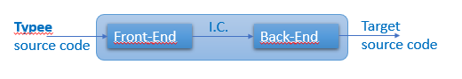

# Typee Software Design

This document is part of the Open Source project **Typee**. As such, it is
delivered under the MIT license:
```
Copyright (c) 2018-2021 Philippe Schmouker, Typee project, http://www.typee.ovh

Permission is hereby granted,  free of charge,  to any person obtaining a copy
of this software and associated documentation files (the "Software"),  to deal
in the Software without restriction, including  without  limitation the rights
to use,  copy,  modify,  merge,  publish,  distribute, sublicense, and/or sell
copies of the Software,  and  to  permit  persons  to  whom  the  Software  is
furnished to do so, subject to the following conditions:

The above copyright notice and this permission notice shall be included in all
copies or substantial portions of the Software.

THE SOFTWARE IS PROVIDED "AS IS",  WITHOUT WARRANTY OF ANY  KIND,  EXPRESS  OR
IMPLIED,  INCLUDING  BUT  NOT  LIMITED  TO  THE WARRANTIES OF MERCHANTABILITY,
FITNESS FOR A PARTICULAR PURPOSE AND NONINFRINGEMENT.  IN NO EVENT  SHALL  THE
AUTHORS  OR  COPYRIGHT  HOLDERS  BE  LIABLE  FOR  ANY CLAIM,  DAMAGES OR OTHER
LIABILITY, WHETHER IN AN ACTION OF CONTRACT,  TORT OR OTHERWISE, ARISING FROM,
OUT  OF OR IN CONNECTION WITH THE SOFTWARE OR THE USE OR OTHER DEALINGS IN THE
SOFTWARE.
```


This document describes the global software design of the **Typee** 
translator. We first explain how we have decided to design this translator. 
Since this design has been largely inspired by *compilers* general design, we 
explain then how modern compilers are designed. In the third section, we
explain the derivative way we have used to design the **Typee** translator.
Finally, we list packages and their roles as well as modules in packages and
the role of each of them also.

We expect this document to help the reader to understand how the **Typee** 
translator has been thought and designed with programming language *Python*, 
and help anyone who would like to contribute to understand what enhancements 
could be proposed and how they could be designed and implemented.

Most of the text of this document has been copied from or has been duplicated 
in other documents elsewhere in this **Typee-Language/Typee** repository.


# 1. Typee Design Concepts

**Typee** is an Object Oriented Programming language. Its syntax is derived 
from other OOP language such as *C++11*, *Java 8.0* and *Python 3.8*.

Traditionnal OOP languages are either compiled (e.g. C++) or interpreted (e.g. 
*Python* ). They even may be first compiled into an intermediate code which is 
then interpreted (e.g. Java and its Bytecode interpreted by a 
*Java Virtual Machine* that has to be implemented on each of the different 
targeted devices).

Meanwhile, **Typee** language is neither compiled nor interpreted. It is 
rather translated into other OOP languages, such as *Python* (which 
chronologically is the first addressed OOP language from: *Python*, *C++* and 
*Java*). During the translation, type infering and checking is done not only 
for APIs but also on all the other parts of the code.

So, we got greatly inspired by modern compilers design to design the **Typee** 
translator. Our bedside book for a long has been "*Engineering a Compiler*",
2nd edtition, Keith D.Cooper & Linda Torczon, 2012, Elsevier, ISBN 
978-0-12-088478-0. and we encourage the reader to read this book.

We have choosen this book because it was newer than the famous Dragoon book 
"Compilers, principles, techniques, & tools, 2nd ed." from Alfred V. Aho, 
Monica S. Lam, Ravi Ethi and Jeffrey D. Ullman, Pearson-Addison Wesley, 2007, 
while this Dragoon book had been used to specify the *Python* interpretor 
*CPython*.


# 2. Modern Compilers Design

By 2018, modern compilers are designed with three distinct communicating 
software modules: the *Front-End*, the *Back-End* and the *Optimizer*. A 
drawing will be simpler to understand.


First, the source code to be compiled is processed by the compiler 
*Front-End*. During this phase, the source code is *scanned* to detect key 
words, numbers, identifiers and the like and *parsed* to check its syntax 
correctness. The *Front-End* transfers to the compiler *Optimizer* an internal 
representation of the source code, which is noted **I.C.** (Intermediate Code) 
in the above picture.

Second, the I.C. is processed by the *Optimizier* whose job is to statically 
optimize the intermediate code. For instance, this consists in the deleting of 
dead code or in the transforming of never-changing variables content into 
constant values. Many other optimizations may be generated by the *Optimizer*.
A new version of the intermediate code, the optimized one, is then passed to 
the compiler *Back-End*.

Third, the optimized version of the I.C. is processed by the *Back-End*.
There, the final binary code to be ran on the target processor is generated. 
Final static optimizations may be generated during this phase also, according 
to the specificities of the target process unit.

Well, this is for the design of three-phase compilers, but two-phase compilers 
exist also, with no *Optimizer* phase. See coresponding schema below.


To get a little bit more information on those three phases of a modern 
compiler, see the three next sub-sections. They are short. But to know more, 
the reader should refer to any book on compilers design. Remember, the one we 
have used for the design of Typee translator is "*Engineering a Compiler*",
2nd edtition, Keith D.Cooper & Linda Torczon, 2012, Elsevier, ISBN 
978-0-12-088478-0.


## 2.1 The *Front-End*

The **Front-End** of a compiler is a three-phase module. See figure below.


Explanations are provided in the next three subsections.


### 2.1.1 the *Scanner*


The source code to be compiled is first scanned by the *Scanner*. This module 
transforms the source code to an ordered list of tokens. This phase of the 
**Front-End** is named also *tokenizer*.

What is a token? It is an entity that describes a whole atomic element of the 
programming language. For instance, there is one token for each of the 
built-in instructions of the language (e.g. **for**, **if**, **else** 
just to name a few, which are associated with resp. to *token_FOR*, *token_IF* 
and *token_ELSE*). Numbers are associated with one token. Identifiers are also, 
whatever they identify: constants, variables, functions, classes or methods, 
etc. Operators are each associated also with tokens (e.g. '=', '+', '<=', 
etc.) Each token is a data structure that may contain local information, such 
as, for instance, the line number and the column index of the corresponding 
text, and this text itself (e.g. for an identiifer or for a scalar constant).

So, the *Scanner* takes as input the source code to be scanned and puts as its 
output some *intermediate code* (I.C.) which is mainly an ordered list of 
detected tokens. This ordered list is then the input of the next phase of the 
**Front-End**, the *Parser*. Let's call it the *tokenized I.C*.


### 2.1.2 the *Parser*


The *tokenized intermediate code* is passed as input to the *Parser*. This 
module parses this I.C. and checks for its correctness according to the 
specified syntax of the programming language.

Such a syntax is defined by its *grammar*. The rules defined this grammar 
describes what are the legal successions of tokens for the defined programming 
language. For instance, in C++, a legal **if** instruction is defined to be 
something like this:

```java
if ( <some test> )
    <a block of instructions or a single instruction>
else
    <another block of instructions or another single instruction>
```

Should any token corresponding to the parenthesis be missing after token 
*token_IF* in the tokenized I.C, the *Scanner* would detect some syntax error 
in the source code. The **Front-End** may then inform the user of these 
syntax errors and most often does not try to correct them.

The output of the *Parser* is another form of *intermediate code* which still 
lists the tokens in the order of their appearing in the source code plus maybe 
some information about the syntax used and the maybe detected errors in the 
source code. This *parsed intermediate code* is then the input of the last 
phase of the **Front-End**, the *Elaborator*. 


### 2.1.3 the *Elaborator*


The *parsed intermediate code* gets statically elaborated in the last phase of 
the **Front-End**, the *Elaborator*. This module finalizes the Front-End 
operations to check for the semantic correctness of the source code.

Among the many elaborations that can take place, we list only two of them just 
for illustrating the kind of processing the *Elaborator* runs.

#### Identifiers Checking

The use of identifiers is checked. Is an identifier associated with a constant 
value? Or is it the name of a function, of a class, of a method or of a 
variable? According to this information, is it used in a correct way. For 
instance, by no way should an *Elaborator* accept the modification of the 
value associated with the identifier of a constant value, as long as the 
programming language allows declarations of constants. Meanwhile, by no way 
the identifier of a scalar variable should be used as a called function.

#### Types inferring and checking

Another kind of elaboration of a source code is the inferring of types (for 
variables and for expressions) and the checking of the correctness of those 
types use. For instance, assigning a long scalar in a variable with shorter 
scalar type may be an issue, and be considered as a warning or as an error 
according to the programming language defined policy.

This type checking is of most importance for typed programming languages. When 
done at compile time, i.e. in a static manner, it allows the static detection 
of possible errors at run time **before** running the final binary code. This 
way, no type checking, which is costly, has to be implemented at run time.

#### *Elaborator* output

The *Elaborator* provides either a list of detected errors or a new form of 
*Intermediate Code* that we will call the *elaborated I.C.*

The errors delivered by the *Elaborator* may have been detected: by the 
*Scanner*, about badly formed or unknown detected tokens; by the *Parser*, 
about syntax errors; and by the *Elaborator*, for instance about types usage 
errors. Whatever the detected errors, they most often are printed on a console 
or in a log file.

The *elaborated I.C*, if source code has been detected as free of errors by 
the **Front-End**, is then passed to the second phase of the compiler, which 
is the *Optimizer* for three-phase compilers, or the *Back-End* for two-phase 
compilers.


## 2.2 The *Optimizer*

Three-phase compilers implement their second phase as a *code Optimizer*. We 
shall not say much about this. The reader is strongly encouraged to see theory 
and explanations in Compiler Design books. Remember, our bedside book for a 
while about this has been "*Engineering a Compiler*", 2nd edtition, Keith 
D.Cooper & Linda Torczon, 2012, Elsevier, ISBN 978-0-12-088478-0.


The *Optimizer* takes as input the *elaborated intermediate code* provided by 
the compiler **Front-End** and generates an *optimized intermediate code* as 
its output. This *optimized I.C.* is then provided as input to the compiler 
**Back-End**.

The *Optimizer* is generally designed as a succession of different levels of 
optimization (see figure above). We list here  four of them: **local** , 
**regional**, **global** and **interprocedural** optimizations.


### 2.2.1 Local optimizations

These are the simplest optimizations. They are operated on local blocks of 
instructions and are considered to be very efficient.

An example of such optimization is the simplification of successive 
instructions when local values of variables are not modified or when 
redundancy can be detected in some of these successive instructions. The 
*Optimizer* automatically removes or simplifies those instructions in the 
*Intermdiate Code*.

Another example of such optimization is when parallelization of instructions 
processing can be detected in successive independent instructions. Such 
instructions may then be reordered in the *I.C.* by the *Optimizer* so that 
the *Back-End* phase of the compiler can later implement more efficient binary 
code if possible.


### 2.2.2 Regional optimizations

Well, code in a block of instructions may also provide or prepare context for 
usefully  improving the code in another block of instructions. Regional 
optimizations deal with this.

This way, for instance, the *Optimizer* can find redundancies and 
constant-valued expressions that a strictly local optimization would fail to 
detect. The *I.C.* can then be smartly modified to take benefit of already 
known context.

The technique of *loop unrolling* is also a regional otpimization. Unrolling 
loops leads to code duplication within loops. If this is not a memory space 
optimization, it is a time consuming one since the loop control is processed 
less times than with no unrolling.


### 2.2.3 Global optimizations (and analysis)

These optimizations deal with code at an entire function level. , for 
instance, they may help:

- detecting uninitialized variables before their use (analysis for error 
detection);
- modifying the placement of global code (optimization).

Using variables before their initialization should be considered as an error, 
since this will mostly lead to some unpredictable behavior of the program. The
detection of such errors before run time can be done by the *Optimizer* phase 
of a compiler.

The modification of the placement of global code deals with the 
characteristics of the target processor. For instance, as long as branching 
cost can be statically evaluated, the *Optimizer* may exchange the places of 
blocks of instructions just to diminish the time processing of a program.


### 2.2.4 Interprocedural optimizations

This is somewhat the *higher* level of otpimizations that can be envisaged. 
Those optimizations deal with groups of functions or methods, trying to 
understand or evaluate their contexts to take benefit of them across functions 
while this would not be possible with intra-procedural (i.e. global) 
optimization.

A first, simple, optimization is the modification of the placement of functions 
code within the final binary image of the program when the *Optimizer* can 
detect that one function calls another one. Placing them as near as possible 
of each other in the final code may optimize time processing, for instance 
when the instructions set of the target processor provides short and long 
range branching and when short branching is quicker than long branching.

A second, not very more complex, optimization at interprocedural level is the 
inlining of functions calls. Rather than generating a call to a function, the 
*Optimizer* may decide to inline the whole code of a function, in place of its 
call, into the code of the calling function.


### 2.2.5 *Optimizer* - conclusion

Optimizations are an important part of a compiler. Thye may take time to be 
processed but they provide optimization either on memory space allocation or 
on time processing ar runtime. They help improving the implementation of a 
program in an aitomated manner with no needed user's intervention.

They are implemented in a dedicated phase within three-phase compilers, but 
they may also be implemented in either the Front-End or the Back-End phase of
a two-phase compiler.


## 2.3 The *Back-End*

The final phase of a compiler is the *Back-End*. It deals with the generation 
of the final binary code according to the target processor and the target 
Operating System. It is mainly a three-phase mmodule.


The *Back-End* gets as its input the *elaborated intermediate code*, as long 
as this I.C. has been generated. Should the previous phases of the compiler 
have detected errors, the *Back-End* would not be ran.


### 2.3.1 Instruction Selection

The *elaborated I.C.* is first evaluated for the **selection** of 
corresponding processor **instructions**. For instance, the assignment of a 
scalar value to some variable will involve at least an assembly instruction 
for the storage of the value into a memory place. But it could be also an 
assembly instruction dealing with register assignment which is far more 
efficient on time consuming. Another example would be the selection of a 
branching assembly instruction according to some test done while implementing 
an **if** instruction. Of course, this step of the *Back-End* generates an 
*intermediate assembly code*, maybe associated with additionnal informatin 
data to help next step processing.


### 2.3.2 Instruction Scheduling

Then, this *intermediate assembly code* is processed by a next step of the 
*Back-End*: the **instruction scheduling**. This is some kind of optimization 
that the *Back-End* may be able to envisage if some assembly instructions are 
available that do time-shorter procesing. For instance, this could be an 
addition of a register with itself rather than a multiplication by 2 or a 
left-shift by 1 bit. It may also invert the position of instructions in the 
flow of the processing to take benefit of some characteristics of the target 
processor (this may be the case when branching for some RISC processors). the 
instruction scheduling generates a modified *intermediate assembly code* which 
is the input of the final step of the compiler *Back-End*.


### 2.3.3 Registers Allocation

This is the final step of the *Back-End* processing. Processors have a limited 
set of registers. This step aims at using all of them in the best way. The 
input *intermediate assembly code* is analyzed here to finally generate a 
binary code with the best use of the target processor registers. This means 
that direct access to memory may be imposed, should the registers be too few.


### 2.3.4 *Back-End* output

The *Back-End*, when called, eventually generates binary assembly code 
dedicated to the target processor. This code can be either formatted code 
with linking information for further linkage with other binary code modules or 
binary code immediately executable on the processor, associated with the 
mandatory embedded glue for it to run n a target environment (e.g. Windows, 
Linux, MacOS, etc.)


## 2.4 Modern Compilers Design - Conclusion

Being either three-phase or two-phase designed, a compiler is composed of:
- a *Front-End* which mainly parses the source code of a program;
- a *Back-End* which mainly generates the binary code to be ran on the target processor;
- and automated optimizations to generate the best final code.

The work done here is a smart translation of a source program easily 
understandable by humans to a binary optimized representation easily 
executable by a target processor in a target environment.

This is one of the reasons why the **Typee** translator may be designed as a 
compiler, since it translates a Typee source program into some other 
programming language source code, for instance *Python*, *C++* or *Java*.

The main point here is that some of a compiler modules are not needed for the
**Typee** translator. For instance, the implementation of optimizations is not 
necessary if we consider that this step will be deferred to the final *C++* or 
*Java* compiler or to the final *Python* interpretor.

Furthermore, many of the tasks devoted to the *Back-End* may be either 
simplified or even ignored by Typee translator since it does not generate 
binary code but source code in some other programming language. 


# 3. Typee Translator Design - from Compiler design

As stated in the above conclusion (see subsection 2.4) the **Typee** design is 
simpler than the one of a compiler, since **Typee** is a programming languages 
**translator** and not a true compiler.

Why is it simpler? Because, as a translator, Typee neither generates binary
code nor optimizes source or intermediate code. Its two main acitivities are 
*static type checking* and *translation* from programming language Typee to 
another programming language such as *Python*, *C++* or *Java*.

Nevertheless, to envisage the design of Typee translator as would be the 
design of a modern compiler is staightforward:



**Typee** source code is first processed by Typee *Front-End*. At this phase 
of the translation, Typee source code is scanned, parsed and elaborated. An
*elaborated intermediate code* is generetad by the *Front-End* and transferred 
to Typee *Back-End*.

The *elaborated intermediate code* is then processed by Typee *Back End*. 
There, all the translation work to another programming language is done, as 
would have been the translating of this intermediate code to some binary 
target code within a compiler.

Meanwhile, many of the tasks done in a compiler are simpler in Typee 
translator implementation.

Furthermore, the *elaborated intermediate code* is totally independent of the 
target programming language. It only depends on the specifications of Typee 
language. So, the exactly same interface between Typee *Front-End* and Typee 
*Back-End* will serve the same purpose for any kind of target programming 
language (i.e. *C++*, *Java* or *Python*).

A consequence of this is that a same *interface* will have to be implemented 
for each target programming language: a version of the *Back-End* will 
translate *elaborated intermdiate code* to *Pytho*n, another version will 
translate *elaborated I.C.* to *C++*, a third one will translate the same 
*elaborated I.C.* to *Java*, etc.


## 3.1 Typee Front-End

**Typee** *Front-End* is a three-phase front-end, as is the case for any 
modern compiler.


It takes as input the source code of a Typee program or file and generates as 
its output an *elaborated intermediate code* that is further processed by the 
Typee *Back-End*.

We describe the design of each of these three **Typee** *Front-End* phases in 
the next subsections.


### 3.1.1 Typee Front-End *Scanner*

The *Scanner* of **Typee** *Front-End* deals with tokens. It takes as input some 
**Typee** source code, scans it, and generates an ordered list of tokens: 
the *tokenized intermediate code* that is provided for input to the **Typee** 
*Front-End Parser*.


#### 3.1.1.1 What's in a token?

In **Typee**, a token is associated with an ID and a default text. Let's take 
an example. **Typee** specifies keywords. Among them are instruction keywords, 
for instance `if`. A specific token is associated with keyword `if`. 
It gets a unique ID and the associated default text is "`if`". There are many 
other kinds of tokens, such as a single token to identify identifiers, tokens 
for every legal punctuation sign, tokens to identify numbers, tokens to 
identify operators, etc.

Class `FEIcodeTokens` defines all the tokens IDs and the associated default 
texts when this gets meaningfull. For instance, there is no default text 
associated with the token for identifiers since there is no default text 
corresponding to any identifier. The related text is rather associated with 
the *identifier-token* each time an identifier is discovered in the scanned 
Typee source code.


#### 3.1.1.2 Tokens and token nodes

Class `FEICodeTokenNode` finally defines the data structure that is linearly 
appended to the *tokenized intermediate code* data. Remember, this is an 
ordered list of tokens that is generated by the *Scanner* and that is provided 
as input to the *Front-End Parser*. This list contains token **nodes** which 
are defined by class `FEICodeTokenNode`. The attributes of each node are:

- the related token ID;
- the associated text as scanned in the Typee source code;
- the line number in the source code and the column index in this line of the 
asociated text with this token.


#### 3.1.1.3 The *tokenized intermediate code*

Finally, class `FETokenizedICode` defines the *intermediate code* generated by 
the *Front-End Scanner*. Since it is currently  implemented in *Python*, this 
is just a wrapper to Python built-in type **list**.

The Typee *Front-End Scanner* runs through the Typee source code, detects 
any Typee keyword, any legal punctuation or separator sign, any valid number 
or other scalar values (boolean ones, string ones, etc.), any indentifier as 
separated by spaces, tabs and legal other separators, any legal operator, and 
maybe any badly formed, unknown or not valid text (such as "`125xyz`" which is 
neither a correct number nor a correct identifier in Typee).

The *Scanner* then appends the related token node to the list of the already 
detected *token nodes*. Remember, this is the *tokenized intermediate code*. 
Badly formed text is also detected by the *Scanner* and replaced in this 
intermediate code by a dedicated token node, the **unexpected token** node. 
This is a useful information to pass to the *Parser*. It allows also for the 
delaying of errors printings after the completion of Typee *Front-End*. This 
way, warnings and errors can be displayed on console or saved in log file in 
the increasing numer of the Typee source code line they have been detected in.

Finally, the *Scanner* passes to the *Parser* the *tokenized intermediate 
code* which is an instance of class `FETokenizedICode` and which contains an 
ordered list of *token nodes*.


#### 3.1.1.4 The Front-End Scanner implementation

The code of the *Front-End Scanner* is implemented by class `FEScanner`. This 
class defines two scanning methods: `scan_file()` and `scan_memory()` for 
which names are self explanatory. `scan_file()` opens a Typee source code file 
and loads it in memory, then it calls `scan_memory()`. `scan_memory()` 
directly scans source code loaded in memory. Their output is an instance of 
class `FETokenizedICode`, i.e. a *Python* list of *token nodes* (each of which 
is an instance of class `FEICodeTokenNode`).


### 3.1.2 Typee Front-End *Parser*

The *Parser* of **Typee** *Front-End* deals with source code syntax 
correctness. It takes as input the *tokenized intermediate code* generated 
by the *Scanner* and checks the succession of tokens against the **Typee** 
language grammar specification. It generates an *intermediate code* that it 
has syntaxically verified, with maybe syntax errors detection flags put in it. 
This *intermediate code* is then passed to the *Front-End Elaborator*. We name 
it the *syntaxic intermediate code*.


#### 3.1.2.1 Programming languages and grammar descriptions

**Typee** grammar is specified according to the *Backus-Naur Form* (*BNF*). 
Tis is a very common and easy way to fully specify the *context-free* grammar 
of a language. Here is an excellent article about BNF and its extensions: 
[http://matt.might.net/articles/grammars-bnf-ebnf/](http://matt.might.net/articles/grammars-bnf-ebnf/).
The curious reader (and all readers should be curious) is strongly encouraged 
to click on this link and to read this article which "*explains grammars and 
common notations for grammars, such as Backus-Naur Form (BNF), Extended 
Backus-Naur Form (EBNF) and regular extensions to BNF. After reading this 
article, you will be able to identify and interpret all commonly used 
notation for grammars.*" (extract from Matt Might's article).


#### 3.1.2.2 A simple example

Let's take an example. A BNF grammar rule to specify a very simple `for` 
instruction could be something like:

```
<for statement> ::= "for" "(" <identifier> "in" <range> ")" <simple statement> ";"
```

For instance, this is a legal `for` loop according to the above grammar rule:
```
for( i in [0:10] )
   print( i );
```

The list of tokens as provided by the *Front-End Scanner*, i.e. the 
*tokenized intermediate code*, would then be something like this (with very 
symbolic notation):
```
token_FOR
token_(
token_IDENT "i"
token_IN
token_[
token_NUMBER "0"
token_:
token_NUMBER "10"
token_]
token_)
token_IDENT "print"
token_(
token_IDENT "i"
token_)
token_;
```

The *Front-End Parser* runs through this list of tokens and checks for the 
validity of the tokens chain against the related grammar rule. You will 
easily verify by yourself that this list of tokens is definitively valid, as 
long as `<range>` is specified as something like `[0:10]` and as long as 
`print( i )` is a valid `<simple statement>`.


#### 3.1.2.3 Syntax errors checking

Now, should there is any syntax error in previous code, for instance because 
of a missing parenthesis, a badly formed range definition or a missing `;` by 
the end of the single statement, the *Front-End Scanner* will detect it while 
parsing the source code and checking it against the related grammar rule. 
Moreover, the *Parser* is able to get what is syntaxically wrong, either 
missing or badly formed, and is able to report the related error with the line 
number in the source code and the column index in this line of the erroneous 
syntaxic item.

Furthermore, should any syntax error be detected, the *Parser* is able to skip 
as little part of the source code as possible. This is **error recovering**. 
With **Typee**, error recovering is done by searching for the next `;` token, 
which is the end of every statement, or for the next token `}` in the case of 
an error occuring in a block of instructions and for which no `;` can be 
found before the `}`.


#### 3.1.2.4 The *Parser* implementation

**Typee** programming language is specified according to an LL(1) grammar. 
As such, it is an LL(1) language. This class of grammars have many advantages 
while developing a *Proof of Concept* (PoC). They are **context-free** 
grammars, which means that nothing has to be remembered about what has been 
previously done when parsing source code. They are **fully deterministic**, 
which means that they definitvely are *unambiguous* grammars. The code they 
define is parsed from Left to right and the *Parser* of LL(1) grammars 
constructs Leftmost derivations while parsing the source code.

LL(1) parsers can be implemented with tables as well as with recursive descent 
functions. They are deterministic, context-free, and intuitive to understand, 
on the contrary of LR(1) parsers which might be more efficient at run-time but 
which are far more complicated to implement, to debug and to read.

The current implementation of the **Typee** *Parser* has been developed in 
*Python*, as a dedicated class `FEParser` with methods to implement every 
rules of **Typee** grammar. This was the easiest and simplest way to develop, 
debug and maintain a PoC for the validation of **Typee** concepts.

Each method of class `FEParser` gets the leading name of one of the grammar 
rules. It calls other methods according to the rule definition. Atomic methods 
finally check for expected tokens.

The *Parser* runs through the *tokenized intermediate code*, gets one *token 
node* at a time and checks it against the **Typee** grammar rules. Every time 
an error is detected, which happens every time an **unexpected token node** is 
read from the *tokenized intermediate code* or when some token node is read 
while not expected or is missing while expected, the *Parser* generates a 
*syntaxic error* node in its generated *intermediate code* and recovers the 
error as smartly as possible (searching for the next `;` or `}` token).

The parsing is ran via method `parse()` which parses the *tokenized 
intermediate code* passed at its main argument. Remember, this is a *Python* 
list in memory that has been previously generated by the *Front-End Scanner*.


#### 3.1.2.5 Resulting *intermediate code*

The *Front-End Parser* generates an *intermediate code* that embeds the 
*tokenized intermediate code* it got as input from the *Scanner*. This *I.C.* 
contains all the generated *token nodes*, including the *unexpected token* 
nodes that had been inserted by the *Scanner*. The *Parser* adds to these 
the *syntaxic error* nodes it generates when encountering such errors.

Furthermore, the resulting *intermediate code* is formatted by the *Parser* 
to reflect the syntaxic nature of the source code. If you go to the last 
version of Typee grammar specifications - look at all successive versions in 
[../Language-specifications/](../Language-specifications/) - you will see that 
a Typee source code is defined as:
```
<code file> ::= <statements list> <ENDOFFILE>
```
with `<statements list>` defined as:
```
<statements list>       ::= <empty statement> <statements list>
                         |  <compound statement> <statements list>
                         |  <simple statement> <statements list>
                         |  <statements block> <statements list>
                         |  EPS
```
and these other statements defined as:
```
<empty statement>       ::= <comment>
                         |  <NEWLINE>

<compound statement>    ::= <assign decl def func-call statement>
                         |  <embed statement>
                         |  <for statement>
                         |  <forever statement>
                         |  <if statement>
                         |  <repeat statement>
                         |  <switch statement>
                         |  <try statement>
                         |  <while statement>
                         |  <with statement>

<simple statement>      ::= <assert statement> <simple statement end>
                         |  <del statement> <simple statement end>
                         |  <ensure statement> <simple statement end>
                         |  <flow statement> <simple statement end>
                         |  <import statement> <simple statement end>
                         |  <nop statement> <simple statement end>
                         |  <access protection statement> <simple statement end>
                         |  <raise statement> <simple statement end>
                         |  <require statement> <simple statement end>

<simple statement end>  ::= ';'

<statements block>      ::= '{' <statements list> '}'
```

According to these grammar rules, each time the *Parser* starts the parsing of 
one of these rules it appends to the *syntaxic intermediate code* a new 
*statement node* to which it attaches a list of either *statement nodes* or 
*token nodes*. These nodes are the ones related to the currently parsed 
statement rule.

The *syntaxic intermediate code* is then a **tree** that reflects the exact 
syntaxic structure of the parsed **Typee** source code. This design greatly 
helps the further *semantic analysis* of the source code that can then take 
benefit of this structured information.

Let's see now what is this *semantic analysis* of the generated *syntaxic 
intermediate code*. This analysis is performed by the third and last phase of 
the *Front-End*: the *Elaborator*.


### 3.1.3 Typee Front-End *Elaborator*

So, this is the third and last phase of the *Front-End*. It gets as input the 
*syntaxic intermediate code* generated by the *Front-End Parser*. Remember, 
this is a **tree** that reflects the syntaxic structure of the translated 
**Typee** source code.


The *Elaborator* semantically analyzes the *syntaxic intermediate code* and:
- categorizes every detected identifier;
- infers types;
- checks for uninitialized identifiers before their use;
- checks for the correctness of types use.

It either generates a *validated intermediate code* and tranfers it to the 
**Typee** *Back-End* or provides an errors report if errors have been detected 
by the *Scanner* or the *Parser*. This report may be displayed on console 
and/or saved in log file.


#### 3.1.3.1 Categorization of Identifiers

The *Front-End Scanner* detects identifiers according to dedicated rules or 
**Typee** grammar. Well, identifiers in Typee are constructyed the same way 
as any other programming languages. They can be constituted of letters, digits 
and underscores. They cannot begin with a digit. They are case-sensitive.

Identifiers are used to identify so many entities in **Typee**:
- classes;
- methods of classes;
- attributes of classes;
- functions;
- variables;
- constant values;
- types.

They can also be used for aliasing other entities. For instance, in **Typee** 
type names contain the kind of type and its bits length. For instance: 
`int32` stands for 32-bits signed integers, `uint32` stands for 32-bits 
unsigned integers. `float32` and `float64` exist also in the same way. Keyword 
`as` may be used to alias those types, as in next code.

```
type int32   as long;
type float32 as float;
type float64 as double;
```

In Typee, `int32`, `float32` and `float64` are built-in types, while in the 
upper code `long`, `float` and `double` are identifiers. They are identifiers 
of types.

The *Scanner* generates a specific token for built-in scalar types. It 
generates also a specific token for identifiers, whatever they identify.

It is the activity of the *Elaborator* to elaborate the kind of entity an 
identifer identifies. This is **semantic** analysis of Typee source code. It 
is based on the running through grammar rules to get what kind of Typee entity 
the identifier is associated with. For example, in next Typee code `MyClass` 
identifies a class, `f` identifies a class method, `val` identifies a class 
attribute and `i` identifies a variable. `class`, `static`, `const` and 
`int32` are Typee keywords. Finally, `print` is a Typee built-in function but 
is detected as an identifier that has to be categorized. Here, it will be as 
identifying a built-in function.
```
class MyClass {
 :public:
    static const int32 f() { return MyClass.val; }
    static int32 val = 0;
}

int32 i = myClass.val++;
print( i, val ); // this prints "0 1" on the console.
```

Those categorizations are elaborated according to the rules of Typee grammar. 
These rules unambiguously specify what an identifier identifies. For example, 
the next Typee grammar rule specifies the correct syntax for the declaration 
of classes.
```
<class definition> ::= 'class' <identifier> ... <statements block>
```
It is then easy to get that the `<identifier>` specified in the rule 
definitively indentifies a class. This was the case for identifier `MyClass` in 
the upper code.

Other more complicated rules in Typee grammar specify the correct syntax for 
declaring functions, methods, attributes, variables, type aliasing, etc. From 
these rules, it is easy also to unambiguously get the kind of entity an 
identifier identifies.

Maybe you can understand now that, while the *Parser* just linearly runs 
grammar rules to check for the correctness of the syntax of a Typee program, 
the *Elaborator* gets a little bit farer, linearly running the same grammar 
rules but running also small portions of elaborating code to add **semantic** 
information to the nodes of the *syntaxic intermediate code*.

Identifiers nodes in this I.C. are then augmented with information about the 
kind of entity (class, method, attribute, function, variable, const value, 
type, ...) they are relating to.


#### 3.1.3.2 Identifiers use checking

Well, it might be that some identifiers will have been detected by the 
*Scanner* then evaluated by the *Parser* as correctly placed in statements and 
in the meantime that they are semantically not correctly used.

For instance, the use a not yet declared identifier should lead to some crash 
at run-time (built-in entities are always declared before their use) or to 
some detected error at compile-time for targeted compiled languages.
```
// error example
const int32 i = j + 1; // unknown 'j'
int32 j = 0;
```

Or the identifier of a variable may be used in some correct expression while 
its value has not yet be initialized. This is semantically not acceptable 
since this eventually leads to unpredictable results.
```
// error example
int32 i;
int32 j = i + 1; // unpredictable value for j
```

Next code gets an error also.
```
type int32 as long;
long i, j, lon;
lon k; // maybe a missing 'g' on type name while 'lon' is a known identifier
```
Here above, `lon` is a known identifier but it does not identify a type. This 
is also a misuse of an identifier.

There are no rules specified in Typee grammar to detect such errors. 
Identifiers have to be elaborated before those checkings can be done. It is 
the role of the *Elaborator* to elaborate misuses of identifiers.

Should any misuse of identifiers be detected by the *Elaborator*, errors nodes 
would be added into the *validated intermediate code* that the *Elaborator* 
provides as its output. This way, errors reporting can be delayed until the 
end of the *Front-End* processing and errors can then be reported in the 
increasing order of the lines numbers they appear in.

Notice that these misuses of variables are detected at "translation"-time in a 
static way. Eventually, some complex situations cannot be statically 
elaborated and will only be appearing at run-time. **Typee** *Elaborator* 
cannot deal with such cases.


#### 3.1.3.3 Types Inferring

**Type inferring** is the elaboration of the type of any typed entity. Here 
again there is no grammar rule to express the type of an entity. This can only 
be elaborated by running through the source code.

The typed entities in any programming languages are:
- the identifiers of variables, functions, classes, methods, attributes, types 
aliases, constant values;
- the expressions that embed identifiers.

Inferring the type of an identifier is quite easy while running through the 
*syntaxic intermediate code*, since each of its nodes unambiguously relates to 
a Typee grammar rule. The *Elaborator* elaborates this when it categorizes 
identifiers (see above related sub-section 3.1.3.1).

Grammar numerous complicated rules specify the valid syntax for Typee 
expressions. Well, these are mainly the same as for any OOP language (for 
*Object Oriented Programming*). Experienced developers should not get in 
trouble with them. But neither the *Scanner*, evaluating tokens, nor the 
*Parser*, checking syntax correctness of a Typee source code, can evaluate the 
type of an expression. Only the *Elaborator* can, after having categorized 
all identifiers.

When adding, multiplying, subtracting or dividing scalar values or variables, 
a static inferring of the result type can be done by using simple rules, or 
even a table. Those rules are very generic, as usual: multiplying an integer 
by a float will result in a float; adding an 8-bits integer and a 64-bits one 
will result in a 64-bits integer; etc.

Static types inferring is possible while running throuh the *syntaxic 
intermediate code* just because the related grammar rules for expressions are 
unambiguous, but as long as the types of every used entities are known at 
static elaboration-time.

You will see, learning **Typee**, that some identifiers may be of one type 
among many and that the type they get may be known at run-time only. The 
*Elaborator* can know this due to Typee grammar rules and take benefit of this 
knowledge while checking types uses. See next sub-section.


#### 3.1.3.4 Types Checking

Once types have been inferred for every entities and expressions detected in 
the Typee source code, **type checking** can take place. This is the final 
phase of the *Front-End Elaborator*.

Here, the consistency of types is elaborated within expressions as well as in 
assignments. For instance, in **Typee** there is no `+` operator defined 
between entities of type boolean and integer. There is no comparison operator 
that jointly uses these types. The assignment of a boolean entity with a 
string value is not allowed also. These are examples of types errors.

The instructions `if`, `while` or `repeat` for instance check boolean 
expresions for evaluating the branching. No other type than boolean is 
allowed to be checked there with **Typee**.

The *Elaborator* checks for such consistencies between types in expressions 
and statements. This involves the elaboration of types consistency. For 
instance, integer and float types are consistent. Rules for their 
transformations into one another are simple to code. They may be put in tables 
also, to optimize checking time.

So, types equivalence is managed through two mechanisms.


##### a. Consistency between Typee built-in types

The first mechanism is the coding of consistency between built-in types. For 
this, we group all integer types together in a single cluster of integers 
(`int8`, ..., `int64`, `uint8`, ..., `uint64`). We group as well all floating 
types into one single cluster of floats (`float32` and `float64`). Char types 
and string types are also grouped into a single cluster of strings (`char`, 
`char16`, `str` and `str16`). Other built-in types (i.e. the sole `bool`) is 
finally grouped in the cluster of booleans.

Consistency is accepted between the cluster of integers and the cluster of 
floats. Meanwhile, checking takes place also about the consistency of these 
types when assigned. Let's take a simple example:
```
const uint32 K = 0x789abcde;
int16 some_variable = K;     // warning here!
```

There, the *Elaborator* can easily evaluate statically that a 32-bits value is 
assigned to an 8-bits one. Types are "consistent" according to their 
respective clusters but assigning 8 bits with 32 bits leads to a loss of 
information. Most programming languages will assign `some_variable` with the 
8 lower bits of `K`, i.e. `0xde` in this case. But this might be an error of 
the coder. The *Elaborator* cannot state about this. In **Typee**, this will 
raise a warning report rather than an error one.


##### b. Consistency with not-built-in types

Not built-in types are types that are declared in the source code that is 
elaborated. For instance, an instance of a class is of the type of this class. 
This is not a built-in type. Furthermore, in OOP classes inherits from 
classes. This mechanisme of inheritance creates consistency between those 
classes that belong to a same inheritance chain.

Here is an example.
```
class Abase{}                       // some base class

class A1( public Abase ) {}         // class A1 inherits from class Abase

class A2( public Abase ) {}         // class A2 inherits also from class Abase

Abase instance_of_Abase = Abase();  // instantiation of class Abase
A1 instance_of_A1 = A1();           // instantiation of class A1
A2 instance_of_A2 = A2();           // instantiation of class A2

? in (A1, A2) some_instance;        // typical Typee instruction, see explanation below
some_instance = instance_of_A1;     // consistent, so legal assignment (1)
some_instance = instance_of_A2;     // consistent, so legal assignment (2)
some_instance = instance_of_Abase;  // consistent, so legal assignment (3)
```

In the above code, types A1 and Abase may be used together in an expression or 
an assignment. The same is true also for types A2 and Abase. So, object 
`instance_of_A1` is type-consistent with object `instance_of_Abase` as well as 
object `instance_of_A2` is also type-consistent with object 
`instance_of_Abase`. 

This special, unusual, next line is typical of **Typee** syntax:
```
? in (A1, A2) some_instance;
```
It declares a new variable, `some_instance`, which can be either of type A1 or 
of type A2 while this is not known at declaration time. The three next 
assignments after this line in the code example are all legal. `some_instance` 
may be assigned type `A1` instances **(1)** as well as `A2` instances **(2)** 
and since `A1` and `A2` types both inherit from class `Abase`, 
`some_instance` may also be assigned an `Abase` instance **(3)**.

The *Elaborator* is able to statically elaborate those consistencies and is 
able to validate these three assignment statements.

Finally, type aliases can also be statically checked for consistency with 
built-in types, since they just are aliases that can be grouped into the 
type cluster of the type they are aliasing.

Should inconsistencies be detected by the *Elaborator*, corresponding *error 
nodes* are generated by the *Elaborator* in the **errors report** it 
generates. See next sub-section.


#### 3.1.3.5 Validated Intermediate Code & Errors Report

At its instantiation time, the *Front-End Elaborator* initializes an empty 
**Error Report**. This is a list of error nodes, ordered on the line 
increasing number where the errors occurred (this information is inserted in 
the *intermediate codes* nodes by the *Scanner* and the *Parser*).

The *Elaborator* elaborates then identifiers categorization, infers types and 
checks for their consistencies as much as possible. For this, it runs through 
the *syntaxic intermediate code* generated by the *Parser*.

Remember, this syntaxic I.C. gets a **tree** structure. The *Elaborator* runs 
through it via a left-most descent walk, I.C. node after I.C. node. It 
eventually get token nodes and maybe will traverse *error nodes*. These are 
either *unexpected token* errors generated by the *Scanner* or *syntaxic* 
errors detected by the *Parser*. Every time an *error node* is passed through 
by the *Elaborator* in the *syntaxic intermediate code*, the *Elaborator* 
appends this *error node* to its **Error Report** list.

Meanwhile, if any types inconsistency is detected by the *Elaborator*, an 
*error node* integrating this inconsistency is appended to the 
**Error Report**.

Once the *Elaborator* completes, it provides the *syntaxic intermediate code* 
and prints the **Error Report**. When the error report is empty, the provided 
I.C. gets the status of **validated intermediate code**.

This *validated intermediate code* is passed then to the **Typee** *Back-End* 
for its translation into the targeted programming language (that is, for 
instance, *C++*, *Java* or *Python*). But if the **Error Report** is **not** 
empty, the erroneous *syntaxic intermediate code* is not passed to the 
*Back-End* which is not called by the main module of the **Typee** Translator.

**Important Note**: It is the role of the *Elaborator* to print the **Error 
Report** either on the console or in a log file. This way, nothing has to be 
transferred back from the *Front-End* about errors.


## 3.2 Typee Back-End

The **Typee** *Back-End* is not design exactly as would be a back-end of a 
modern compiler. While it translates some *intermediate code* into a final 
representation of the initial source code, it only does a translation from a 
programming language, **Typee**, into another programming language, *Python*, 
*C++* or *Java* for instance. **Typee** *Back-End* does **not** generate some 
optimized binary code that will be run with a targetted processor. No. 
**Typee** *Back-End* rather translates an initial source code into a targetted 
source code.

Many of the *traditional* processing of a modern compiler back-end have 
neither to be implemented nor to be designed for **Typee** *Back-End*.

Meanwhile, we aim to implement different translators from **Typee** to other 
programming languages. These translators will, for sure, share common 
functionnalities. But, for sure also, they will not deliver similar source 
codes since these will have to conform to the targeted language syntax.


### 3.2.1 Translators design

So, we design a base class `BETranslateBase` that defines as most common 
features as possible for every specific translator. This will be used as a 
skeleton for inheriting classes.

We then design one dedicated class for each translator to programming 
languages. Each of these classes, e.g. `BETranslatePython`, `BETranslateCpp` 
or `BETranslateJava`, inherits from the base class `BETranslateBase` and 
implements its specific parts (methods and attributes) dedicated to the 
targeted language it is translating to.


### 3.2.2 Translators callee

Translators are called by the main module of the **Typee** Translator. Notice 
that no translator will be called if the *Front-End* finally displayed or 
logged an errors report. Any erroneous **Typee** source code will **not** be 
translated to targeted programming language. Corrections have to take place 
before, under the sole responsability of the coder.


### 3.2.3 Translator processing

So, at its instantiation time (i.e. at construction time), the translator 
version related to the targeted programming language initializes an empty 
*targeted source code*. The translator may put in it any starting comments, 
for instance copyright and/or license notices passed to it, as well as other 
mandatory notices (as is the case for *Python* running under *Linux*).

The translator runs then through the *validated intermediate code* that has 
been validated by the *Front-End*. Remember, this is a tree structure. 
Translators run through this structure according to a most-left recursive 
walk. Every time they encounter a new statement, they translate it to a 
corresponding statement in the targeted programming language.


### 3.2.4 An exemple

Let's have an example. Here is below some not much useful **Typee** code.

```
class MyClass
{
 :public:
    MyClass(){
        me._val = 0;
    }
    MYClass( const uint16 v ){
        me._val = v;
    }
    
    none print_vals(){
        for( uint16 i in [:MyClass._K] )
            print( me._val + i, ' ' );
    }

 :private:
    static uint16 _K = 10;
    uint16 _val;
}
```

**C++** translated code will be:

```cpp
class Myclass
{
  public:
    MyClass()
      : _val( 0 )
    {}
    MyClass( const unsigned short v )
      : _val( v )
    {}
    
    void print_vals()
    {
        for ( unsigned short i = 0; i < MyClass._K; ++i )
            printf( "%d ", _val + i );
    }
    
  private:
    static unsigned short _K = 10;
    unsigned short _val;
}
```

while **Python** translated code will be:

```python
class MyClass:
    def **init**(self, v:int=0):
        self._val = v
    
    def print_vals(self):
        for i in range(MyClass.**K):
            print( self._val + i, end=' ' )
    
    **K = 10
```

Translation here is not a context-free processing, for instance since it 
might be that the
translation of many methods will have to be grouped in a 
single one. For instance, have a look at the *Python* translation of the 
**Typee** class constructors. So, it might be that not every source code 
will be translatable in an automated way.

It is the role of the translators to envisage correct translation in as many 
different situations as possible. The unambiguous syntax of **Typee** as 
well as the unambiguous syntaxes of the first targeted programming languages 
should greatly help.

The experienced coder will be able to evaluate here the difficulty of the 
task, while the original code was quite simple. The **Typee** PoC aims at 
prooving that source code can be translated from one unambiguous programming 
language to another non ambiguous programming language, or not.


# 4. The Typee Translator Main Module

In the two previous long sections, we have discussed the two main packages of 
**Typee** translator software: the `FrontEnd` ad the `BackEnd` ones.

In the next section, we will discuss other packages that contain utilities and 
tools developed in the frame of **Typee** PoC.

But the whole mechanism of the **Typee** translator has to be controled by a 
main application. This application is a *Python* module. It is a *Python* 
script. It parses the command line to get the translation options and the 
path(s) to the Typee source code that is to be translated (which may be 
multiple source files). Then, it successively calls the different modules of 
the *Front-End*: the *Scanner* first, then the *Parser* and finally the 
*Elaborator*. It checks for the validity of the final *intermediate code* 
produced by the *Front-End* and passes it to the required *language 
translators* as specified in the command line options.


## 4.1 The Typee Translator Main Application

This main application is named `typee.py` and can be found at the sources root 
directory of the project: `src/`. Since the first implementation of **Typee** 
translator is a Proof of Concept developed in *Python*, it has to be run with 
command:

```
$ python typee.py [options and other arguments]
```


where `[options and other arguments]` are defined in a dedicated separated 
document.


## 4.2 Programming Languages Translation Processing

`typee.py` first imports every needed module. It calls then them, as many 
times as there are Typee source files to be translated, one source file at a 
time.


### 4.2.1 Front-End processing

The Translator script first instantiates `FEScanner`, then it calls its 
method 
`scan_file()`. The path of the current Typee source file is provided 
as the 
argument of this method. It gets back a reference to the *tokenized 
intermediate code* generated by the *Front-End Scanner*.

The script instantiates then `FEParser` and calls its method `parse()` to 
parse the *tokenized intermediate code* that is passed to it as an argument. 
This method evaluates the syntaxic correctness of the parsed source code and 
generates as output a reference to a *syntaxic intermediate code*.

This *syntaxic intermediate code* is then passed as an argument to the 
*Elaborator*. This one is first instantiated and the script calls its method 
`elaborate()`. There, the semantic correctness of the source code is 
evaluated
. For this, as seen before, types of identifiers and types of 
expressions are elaborated and the correctness of types uses is evaluated. 

The *Elaborator* may print an **errors report**, should any error having 
been detected in the previous phases of the *Front-End*. In such a case, the 
*Translator* script is considered as being completed and it stops with an 
error notice on console (at least, total number of detected errors plus a 
reminder of the path to get access to the log file if the errors report was 
asked to be logged in the options of the command line).

### 4.2.2 Back-End processing

If no error has been detected by the previous phases of the *Front-End*, the 
main script instantiates every *Back-End translators*, one different for each 
of the specified targeted programming languages.

Those dedicated translators generate as many source code files as necessary, 
each in a language-dedicated sub-directory (i.e. `./python/`, `./cpp/` or 
`./java/` for instance), the paths of these sub-directories being relative to 
the directory of the translated source files. Notice: this last specification 
is highly subject to change.


## 4.3 Main Application - Conclusion

Once either the translation main script has stopped due the detection of any 
kind of error or this script completes with final trnslation of **Typee** 
source code into the targeted programming languages, the user gets
- either a full **errors report** with errors printed or logged in the 
increasing order of the line numbers that have been detected;
- or a full set of translated files into dedicated sub-directories for each 
**Typee** source file that will have been translated.

It might be that, among many source files to be translated, some of them will 
have been translated while the others will have failed their translation due 
to some coding error (syntaxic or semantic detected errors). When asking again 
for the translation of the source files, the **Typee** Translator script 
compares the last dates of modification for every **Typee** source files and 
their respective translated source files. If the resulting files of the 
translation are *younger* than the **Typee** source files, then the 
translation process is **not** run again.


# 5. Typee Implementation - Packages and Modules

The first implementation of **Typee** translator aims at proving the concept 
of programming languages translations and at understanding the issues this 
raises and how to solve them. This is a PoC, or *Proof of Concept*.

*Python* has been chosen for the development of this PoC, for the ease of 
prototyping this programming language offers. In *Python*, we design 
*packages* and *modules*. A *Python module* is a file containing *Python* 
source code. A *Python package* is a directory that contains modules plus a 
special module named `**init**.py` that may be empty but which is mandatory.

It is straightforward to envisage the creation of a package for the 
*Front-End* code (named `FrontEnd`) and another one for the *Back-End* code 
(named `BackEnd`). These packages may embed sub-packages also. We will see in 
the related sub-section below that this is the case for the *Front-End*. There 
must be common code, developed in modules, that is used by many other modules 
maybe in different packages. So, we design a package named `Commons`. We have 
put in there two *Python* module templates also, that we use to create new 
*Python* modules while developing **Typee** PoC. We may need also some S/W 
tools that we will have to develop for the creation of the **Typee** PoC. A 
package named `local_tools` is dedicated to this. Finally, we will eventually 
test the developed *Python* code of the **Typee** PoC. A package `Tests` 
embeds all these tests, with sub-packages also.

We specify in next subsections every *Python* package created for the 
development of the **Typee** PoC. In each of these subsections, we specify the 
different *Python* modules those packages contain.

Notice: while developping a *Proof of Concept* of **Typee** translator, we do 
not deal with optmizations, neither on used memory space nor on processing 
time. We accept the *Python* developed code to be sometimes very naive as 
long as this eases its reading, its understanding and moreover its debugging. 
Optimizations could happen then, once the **Typee** PoC developed.  See last 
section 5.6 below (*further work and conclusion*) to get more on this.


## 5.1 Package `FrontEnd`

As specified in above sections, the **Typee** *Front-End* is composed of 
three connected componenets: the *Scanner*, the *Parser* and the *Elaborator*. 

Package `FrontEnd` in Typee translator contains then three sub-packages: 
`Scanner`, `Parser`, and `Elaborator`. We describ their designs in the next 
three subsections.


### 5.1.1 Subpackage `FrontEnd.Scanner`

Contained modules:
- `fe_scanner.py`.

So, there is only one contained *Python* module in this package. In there, 
class `FEScanner` is defined. This is the implementation of the 
*Front-End Scanner* of **Typee** PoC (*Proof of Concept*).

At construction (or instantiation) time, class `FEScanner` instantiates an 
empty *tokenized intermediate code* object and initializes line number and 
column index in line, prior to scanning.

Class `FEScanner` defines two public methods, `scan_file()` and 
`scan_memory()` that can be called by an external callee (this is, for the 
**Typee** PoC, the main module of the **Typee Translator**).

Method `scan_file()` opens the file containing **Typee** sopurce code to be 
translated, loads its whole content in memory and calls then method 
`scan_memory()`.

Method `scan_memory()` scans the **Typee** source code in memory, *tokenizes* 
it until the end of the source code and gives back a reference to its internal 
*tokenized intermediate code*. The *tokenization* of the source code is 
processed by private method `_tokenize()`. 

Private method `_tokenize()` checks for types of read tokens and internally 
calls private methods related to the corresponding token types.

Tokens types are defined in class private dictionaries. Characterization of 
chars are defined in private class strings.

Few private methods are defined also to factorize often run Python code.


### 5.1.2 Subpackage `FrontEnd.Parser`

Contained modules:
- `fe_parser.py`.

Here again, there is only one *Python* module in this package. In there, class 
`FEParser` is defined. This is the implementation of the *Front-End Parser* of 
**Typee** PoC.

At construction (or instantiation) time, class `FEParser` instantiates an 
empty *syntaxic intermediate code* object. This will be its returned data 
structure after having parsed the input *tokenized intermediate code*.

<*to be completed* in revision v0.2.1 of this document>


### 5.1.3 Subpackage `FrontEnd.Elaborator`

<*to be completed* in revision v0.3.1 of this document>


## 5.2 Package `BackEnd`

<*to be completed* in revision v0.4.1 of this document>


## 5.3 Package `Commons`

<*to be completed* in revision v0.5.1 of this document>


## 5.4 Package `local_tools`

<*to be completed* in revision v0.5.1 of this document>


## 5.5 Package `Tests`

<*to be completed* in revision v0.6.1 of this document>


## 5.6 Further Work and Conclusion

Ok, so we are developping a **Typee** Proof of Concept, using *Python* as the 
programming language for this development project. This code might not be much 
optimized as long as this helps the developed code to be easy to read, easy 
to understand, easy to maintain and more over, easy to debug.


### 5.6.1 Further Work

Once the **Typee** PoC developed, we will be able to translate **Typee** 
source code in *Python* first, then in *Java* and/or in *C++* (once the 
related *Back-Ends* will have been developed also).

So, further work should be the development of **Typee** Translator in... 
**Typee**! And of course, we should develop it with optimizations. We will 
then be able to translate the deveopped Typee code in *Java* or in *C++* once 
the related *Back-Ends* will have been developed. This means that we will get 
**Typee** translators that will be far faster, running on many different 
platforms and under many different environments (well, which is already the 
case with the first PoC developed in *Python*).


### 5.6.2 Conclusion

Meanwhile, we can't conclude yet since the **Typee** PoC is not already 
available. We are totally confident in the result we will obtain: the 
**Typee** Proof of Concept will be working, first translating **Typee** 
source code into *Python* source code, then translating it to *C++* and 
*Java* source codes.

But we have not yet proved this and still have to develop the PoC. This 
document currently explains the design of the PoC with programming language 
*Python*. As soon as this PoC will have been developed (or failed to), we will 
be able to propose some conclusion here.

Should the conclusion finally be positive (and we trust it will), we will 
provide new releases of this document. They will explain the design of further 
developments, in **Typee** language. Won't this be amazing?


## Annex - This document revisions history

| Date  | Rev.  | Author(s)  | Comments  |
|---|---|---|---|
| 2018-07-30 | 0.0.1 | PhHays | Very first creation. Introduction written and empty sections added. |
| 2018-07-30 | 0.0.2 | PhHays | Completed section 1. |
| 2018-08-09 | 0.0.3 | PhHays | Augmented sections 2. and 3. |
| 2018-08-10 | 0.0.4 | PhHays | Completed sections 2.1 to 2.4, augmented section 3.1 |
| 2018-08-11 | 0.0.5 | PhHays | Completed section 3.1 |
| 2018-08-12 | 0.0.6 | Schmouk | Augmented section 4.; completed its intro and subsection 4.6 |
| 2018-08-12 | 0.0.7 | PhHays | Added a new section 4. on the main module of the Translator; renamed section and subsections 4. with 5. |
| 2018-08-12 | 0.0.8 | Schmouk | Augmented section 5.1 |
| 2018-08-12 | 0.0.9 | PhHays | A few corrections; completed section 3.2; removed not useful section 3.3 (redundant with section 4.) |
| 2018-08-12 | 0.1.1 | PhHays | Completed section 4. This is the very first draft revision of this document, noted v0.1.1. It is not fully completed but is enough filled to keep on coding Typee code |
| 2018-08-12 | 0.1.2 | Schmouk | Corrected mispelled intermediate code classes |
| 2019-02-06 | 0.1.3 | Schmouk | Typo correction in title of section 3. |
| 2019-04-10 | 0.1.4 | Schmouk | Typo correction in C++ example code. |
| 2020-06-21 | 0.1.5 | Schmouk | Replaced '_' with '*' as marks for text formatting. |
|  |  |  |  |
