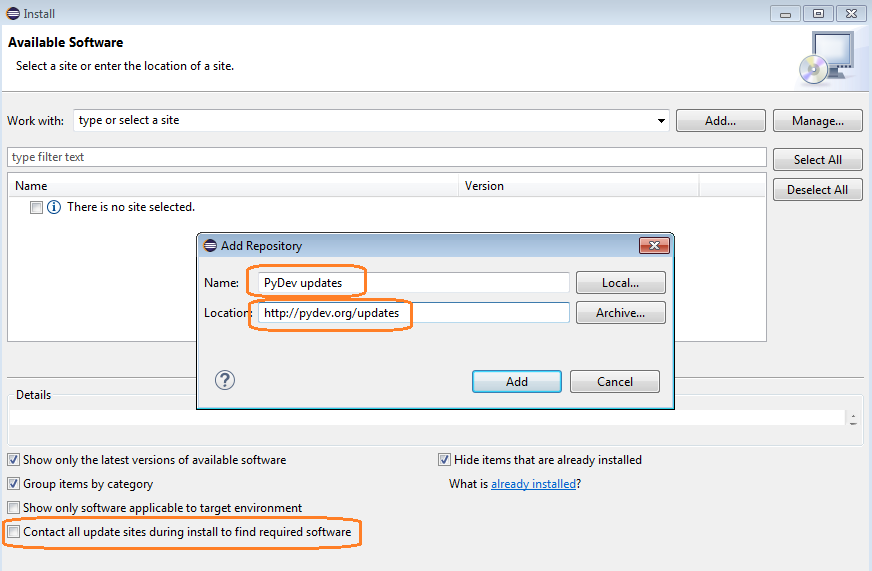
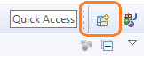

# Project Typee - Development environment recommendations

For the ones who would like to contribute, or the ones who would like to get
access and modify code files by their own, here are the few recommendations we
make and a detailed description of how-to install the recommended development
framework.

Please notice that the use of the recommended development environment is _not_
mandatory to use or to modify __Typee__. This Open Source project, provided
with the MIT license, may be used or modified with many other environments.

Finally, the next text is for Windows and Linux users only. If you develop
under MacOS you can skip all these details.

## A four-steps installation

To modify Typee, you will need to install:
- Eclipse, the development framework;
- Java, the language Eclipse has been developped with;
- PyDev, the Eclipse plug-in to develop in Python;
- and Anaconda 3, a complete Python 3.x environment with the Python interpreter.

## Eclipse Photon (4.8)

[Eclipse](http://www.eclipse.org) is an Open Source development framework from
Eclipse Foundation. The last released versions of this framework, dedicated to
your Operating System and the CPU architecture (32- vs. 64-bits) are directly
available for download here: 
[http://www.eclipse.org/downloads/](http://www.eclipse.org/downloads/)

The one we use for Typee programmation is Eclipse Photon (4.8 - June 2018).
So, this is the recommended version of Eclipse to use. If you do so, you will
take immediate benefit of the two files `.project` and `.pydevproject` that
are provided at the root of the Typee repository.
But you may also use an older version of Eclipse (see item __More Downloads__
for a list of former versions of Eclipse, available here:
[http://www.eclipse.org/downloads/eclipse-packages/](http://www.eclipse.org/downloads/eclipse-packages/]
as well as you may use a newer version of Eclipse as should eventually happen
(Photon is the last stable release of Eclipse by July 2018).
Of course, would you use a version older than Photon, you should create a
new project by yourself (see below). Meanwhile, should you use a newer version
of Eclipse, you could then use the two `. ...project` configuration files as-is.
Eclipse will modify them accordingly to the version of Eclipse you use.

Once the installer of Eclipse has downloaded on your local machine, we recommend
you to install `Eclipse IDE for Java Developers` (from the many other versions
that are available also on the Eclipse.org website).

Installation is really straightforward. You should not encounter any kind of
issue to install it.

## Java 8 (8.171)

Mind this gap. Eclipse framework is developed in Java. You definitively need
to install a Java Run Time (JRT) on your machine to be able to run Eclipse. If 
there is no Java Virtual Machine already installed on your device, you might 
have already been asked or even proposed to install the last available version 
of JRT.

We recommend you to install the very last version of Java. Just navigate with
your favorite Web browser this site:
[https://java.com/download/](https://java.com/download/]. It may redirect
automatically you to the localized version of this page (as 
https://java.com/__en__/download/ or https://java.com/__fr__/download/ for
instance).
By July 2018, last version of Java is Java 8 Update 171 (April 17, 2018).

Just download it and let it install itself. You should not encounter any
kind of issue during this process. Java has been installed billions of times
on so many different kinds of machines...

## PyDev plug-in

Once Eclipse has been installed, in its Java framework version, you cannot yet
program in Python. Sob: this is the language we are using to develop the very
first version of the Typee translator.

_PyDev_ is a dedicated plug-in that allows Python programming with Eclipse. You
do not have to download and install it by yourself. You rather have to ask for
its installation via Eclipse. This is the reason why you first have to install
Java and Eclipse.

To install _PyDev_ plug-in go to Eclipse, click `Help` (sic!) in the menu bar
and click on the `Ìnstall New Software` item:

A modal window will be shown. Click on the `Add...` button as shown below

A new modal window will be shown. Edit the two fields this way:
* type any name you wish in the `Name` field; we suggest to enter here
something like "PyDev Updates";
* type then this exact URL in the `Location` field: 
"http://pydev.org/updates".

Then, you're nearly done. The previous modal window named "_Install_" gets
active again. Click on the `PyDev`check-box to ask for the installation of
_PyDev_. You may ask also for the installation of `PyDev Mylin integration`
but this is optional and not needed four our needs.
The `Next >` and `Finsih` buttons will then become active. You just have to
click `Finish` to get your checked options installed.

During the installation process, you might (or maybe should) have to accept the
installation of a non validated software. It's PyDev and it's ok, just accept it.
You will eventually have to accept its license agreement. Nothing bad in it, check
the acceptation box and validate.

Last but not least, at the top right corner of Eclipse window, you can see the
currently available perspectives. You should normally have the only a _Java_
perspective shown there:

Click the `add new perspective` icon as shown in above picture. Then, in the
modal window shown, select `PyDev` and click on the `Open` button to add the 
Python perspective:

Do not hesitate to repeat the last two steps to get the `Debug` perspective 
also. You should end with those perspectives accessible at the top right corner
of the Eclipse window:

Click on the `PyDev` icon to see the Python perspective displayed in Eclipse.
You are then ready to program in Python.

Please notice that we shall not explain here how to program in Python with 
Eclipse, how to create new Python projects or how to debug. All of this is out
of the scope of this document and is very well explained and detailed 
elsewhere on Internet. To learn things about this, Google and StackOverflow 
are your best friends!

## Anaconda 3

Well, after previous steps you will still not able to create Python projects
or to run any Python module unless you have previously installed a Python
interpreter.

Whatever is your current Python processing environment, or should you have none
yet, we __strongly__ recommend you to install _Anaconda 3_. This is an Open
Source package management from [https://conda.io/](https://conda.io/). It is
available for many different Operating Systems. Downloads can be done, for
Python programming, from there: 
[https://conda.io/docs/user-guide/install/download.html](https://conda.io/docs/user-guide/install/download.html)
You can either choose to install `Anaconda` (full package, recommended) or 
`Miniconda` (far smaller package, with full Python interpreter and built-in
libraries).

- For downloading `Anaconda` according to your Operating System and your
CPU architecture, just go there:
[https://www.anaconda.com/download/](https://www.anaconda.com/download/) and
ask for the installation of Python 3.6. This is mandatory to use our Typee
project since this is the version of Python we are currently using for our
developments. 
- For downloading `Miniconda` according to your Operating System and your
CPU architecture, just go there:
[https://conda.io/miniconda.html](https://conda.io/miniconda.html) and
ask for the installation of Python 3.6. This is mandatory to use our Typee
project since this is the version of Python we are currently using for our
developments.

You will then be able to easily install Anaconda 3 on your machine either by
running the installer or by processing the explained installation steps.

Once done, each time you will create new Python projects with Eclipse, you
will be able to specify the Python 3.6 interpreter that you have installed to
be the Python interpreter to be used. PyDev can find this version of the
Python interpreter at the correct place by itself, just asking you to confirm
that this is the correct interpreter you want to use.
This way, you will also be able to state other versions of Python interpreter
you would have formerly or lately installed.

## That's it

Enjoy!
